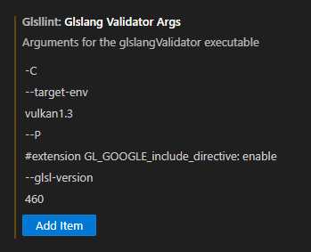

While a common way to use GLSL, editing bare text files or embedded strings is not a scalable way to write programs.

This article will show how to make programming in GLSL more tolerable with linting and various means of code reuse.

<!-- truncate -->

## GLSL Linters

My only requirement for a GLSL linter is that it prevents me from being surprised by shader compilation errors when I run my program. That means, in addition to reporting errors it finds, it should support features like `#include` and allow me to set defines at compile-time.

### Visual Studio Code

- [GLSL Lint](https://marketplace.visualstudio.com/items?itemName=dtoplak.vscode-glsllint): provides syntax highlighting and error detection.
  - Requires glslangValidator from [the Vulkan SDK](https://www.lunarg.com/vulkan-sdk/) or compiled yourself. The path to the executable must be supplied in the extension settings.
  - Compiler flags are supplied as a list in the extension settings.
    - I use `-C` (show multiple errors), `--glsl-version 460` (automatically sets the shader `#version`), and `--P #extension GL_GOOGLE_include_directive` (so I don't have to write that in every file).
    - OpenGL users should add `--target-env opengl` for it to use OpenGL semantics.
    - Each "part" of an argument separated by a space needs to be provided as a separate item of the list:
  - File extensions can be associated with specific shader stages in the extension settings. By default, it will detect common file extensions like .vert, .frag, and .comp. It also understands .frag.glsl, etc. automatically.
  - Supports my convoluted `#include` hierarchies.
- [Error Lens](https://marketplace.visualstudio.com/items?itemName=usernamehw.errorlens): makes errors easier to read. Not specifically related to GLSL, but still useful to have.

Note that Visual Studio Code requires restarting for changes to extension settings to take effect.

Here is an example of arguments provided to GLSL Lint:



### Visual Studio

- [GLSL language integration (for VS 2022)](https://marketplace.visualstudio.com/items?itemName=DanielScherzer.GLSL2022): provides syntax highlighting and error detection.
  - Similar to GLSL Lint for Visual Studio Code in terms of features.
  - Can use an external compiler, such as glslangValidator.
    - `%VULKAN_SDK%/Bin/glslangValidator.exe`
  - Compiler flags are supplied as a single string
    - I use these flags `-C --target-env vulkan1.3 --P "#extension GL_GOOGLE_include_directive: enable" --glsl-version 460`
  - I haven't had much luck with this extension understanding my setup for `#include`, but it could be (and probably is) a skill issue on my part.
- [inline_glsl](https://marketplace.visualstudio.com/items?itemName=kristian-r.inlineglsl): provides syntax highlighting and error detection inside C strings containing GLSL.
  - Requires annotating C strings containing GLSL with a comment.
  - Has no extension settings.
  - Only supports OpenGL GLSL.
  - Does not use an external GLSL compiler.

## Code Reuse

### `#include` support

OpenGL GLSL doesn't support `#include` (GL_ARB_shading_language_include barely counts), so we must find an external way to support it. There are a few viable ways to gain support for `#include` in your shaders if you're using OpenGL, in increasing effort:

- [stb_include.h] provides a simple interface for expanding includes in shader sources without evaluating other preprocessor directives (which means it expands `#include` directives in inactive preprocessor blocks).
  - [My fork of it](https://github.com/nothings/stb/pull/1336) fixes the const-incorrect API, which can annoyingly require `const_cast` to use in C++.
  - [My super secret forbidden fork of it](https://github.com/JuanDiegoMontoya/Frogfood/blob/main/vendor/stb_include.h) fixes nested includes and some other minor issues, but introduces a C++17 standard library include (`<filesystem>`) for implementer convenience.
- [ARB_shading_language_include](https://registry.khronos.org/OpenGL/extensions/ARB/ARB_shading_language_include.txt) extends OpenGL by letting the user define a virtual filesystem that will be searched when include directives are found.
- Writing your own preprocessor?!?
  - Just make sure it supports nested includes.
  - Even if you don't use its virtual filesystem, `ARB_shading_language_include` adds support for C-style `#line` (containing a string) which can improve error messages when used.
- [glslang](https://github.com/KhronosGroup/glslang) and [shaderc](https://github.com/google/shaderc) (whose shader compiler is essentially a glslang wrapper) provide C++ interfaces for processing, compiling, and linking shaders.
  - If you want to supply shaders to OpenGL with `glShaderSource` (and let's face it: you should), you can first use glslang to only preprocess the shader, which will expand `#include`s and other directives, then return a string. glslang explicitly warns against this usage as it's not officially supported, but it worked on my machine! The downside to this approach is that errors reported by the driver will be in the "wrong" place after expanding includes. This can be mitigated by using a linter (see above) or fully compiling and linking the shader with glslang, which itself will report errors in the correct places.
  - If you want to supply shaders to OpenGL with `glShaderBinary` (you don't), glslang can compile shaders into a SPIR-V binary with little more code than it takes to preprocess them.
  - Both glslang and shaderc require writing an include handler to tell the compiler where to find included files. This gets a bit hairy with nested includes. I'm surprised there isn't a default implementation, so [here's a link to my hacky one](https://github.com/JuanDiegoMontoya/Frogfood/blob/main/src/Fvog/Shader2.cpp#L70-L116).

#### Vulkan

Since Vulkan GLSL users are likely to be already using glslang in some fashion (be it the CLI or API), adding support for `#include` is straightforward. CLI users don't have to do anything. API users must write an include handler as outlined above. In either case, I suggest adding `#extension GL_GOOGLE_include_directive : enable` to the preamble to preserve your fingers (`--P` in the CLI, `TShader::setPreamble` in the API).

shaderc automatically enables `GL_GOOGLE_include_directive`, so its users do not need to enable it themselves.

### Sharing Code Between the Device and Host

Writing the same structure definitions for buffers in both C or C++ and GLSL is annoying and prone to error.

#### My Solution

is to abuse macros. It also requires shading language includes.

The first step is to write a "shared header" of common definitions that can be understood by both GLSL and C++. This file is split into sections that are only compiled in one language or the other:

```glsl
#ifndef COMMON_H
#define COMMON_H

#ifdef __cplusplus // C++ definitions

#include <cstdint>
#include <glm/glm.hpp> // Prefer glm/{vecM, matMxN}.hpp. I only use this for brevity
#define FROG_UINT32 std::uint32_t
#define FROG_VEC4   glm::vec4

#else // GLSL definitions

#define FROG_UINT32 uint
#define FROG_VEC4   vec4
#define alignas(x)

#endif

#endif // COMMON_H
```

The second step is to put structure definitions in a file that both languages understand. This can be a separate header, or in the body of the shader itself. For an example of the latter:

```glsl
// Common section
#include "Common.h"

struct Args
{
#ifdef __cplusplus // Simple constructor to initialize with safe defaults
    Args() : dimensions(0, 0), samples(1) {}
#endif
    FROG_IVEC2 dimensions;
    FROG_UINT32 samples;
};

#ifndef __cplusplus // GLSL-only section

layout(binding = 0) readonly buffer ArgsBuffer
{
    Args args;
};

void main()
{
    // Do some shadery things
}

#endif
```

C++ source files can include this file to see the definition of `Args`.

Note that including shader sources like this only works if the `#version` directive can be omitted (e.g. if it's part of the preamble). It cannot be placed into a preprocessor block due to wacky GLSL rules:
> The `#version` directive must occur in a shader before anything else, except for comments and white space.

As usual, care must be taken to ensure the host and device impementations don't disagree in your structs' packing. [`alignas`](https://en.cppreference.com/w/cpp/language/alignas) can be used to force a particular alignment on the host, or explicit padding words can be added where the device would otherwise implicitly assume there to be padding.

```glsl
struct Frog // With alignas
{
    alignas(16) FROG_VEC3 position;
    alignas(16) FROG_VEC3 direction;
};
```

```glsl
struct Frog // With explicit padding
{
    FROG_VEC3 position;
    FROG_UINT32 _padding00;
    FROG_VEC3 direction;
    FROG_UINT32 _padding01;
};
```

If GLSL's packing rules confuse you, I suggest reading about them in [the spec](https://registry.khronos.org/OpenGL/specs/gl/glspec46.core.pdf#page=168) (7.6.2.2 Standard Uniform Block Layout). Beware sources that aren't the spec, as they are often wrong!

Happy shading!
