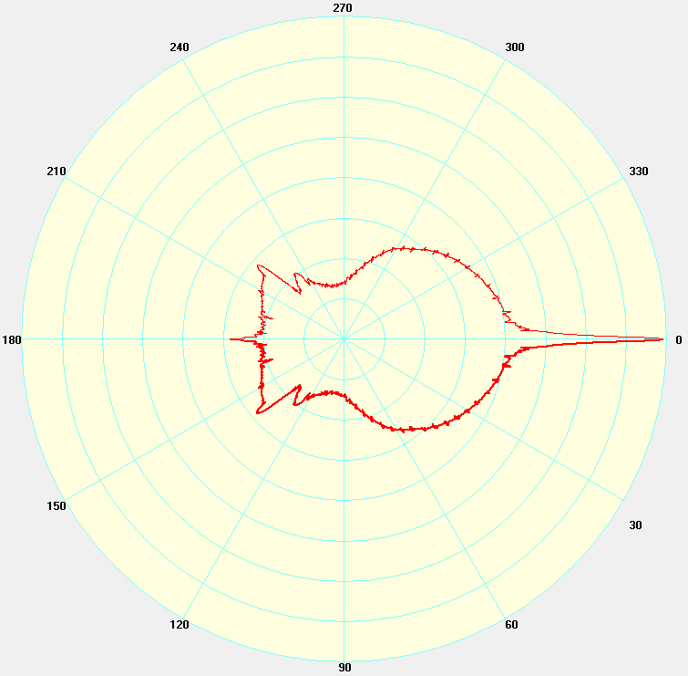
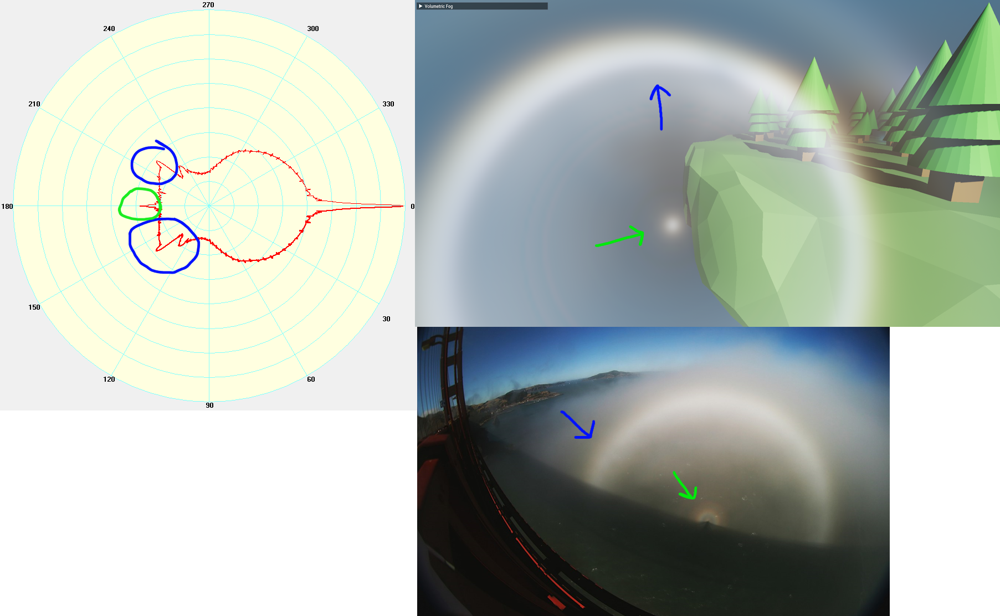
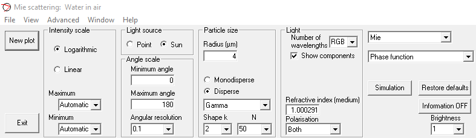
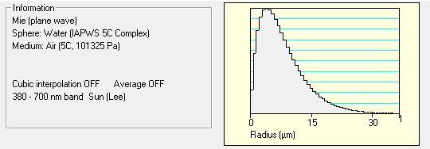
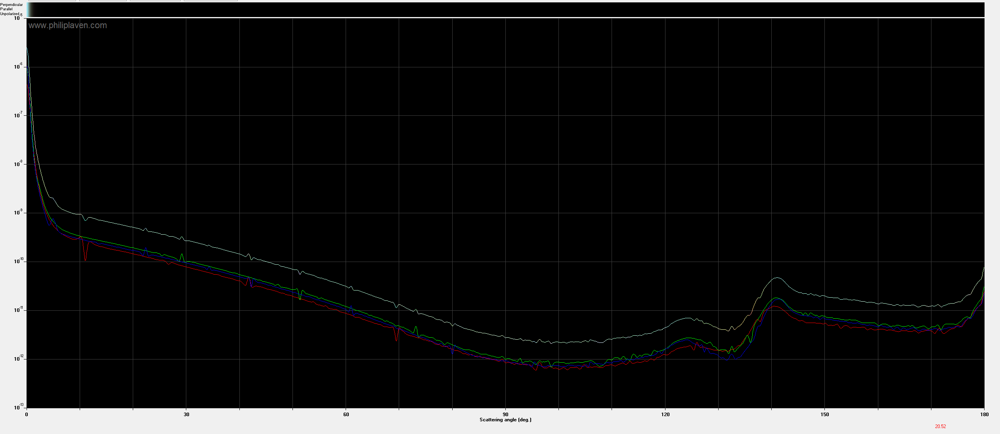
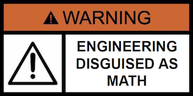
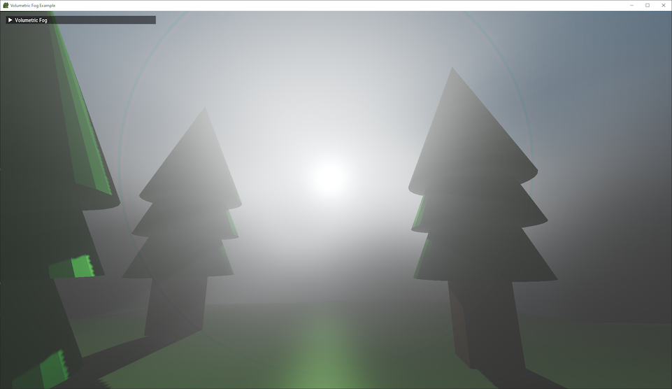
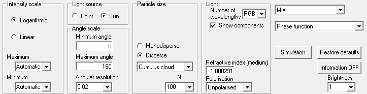
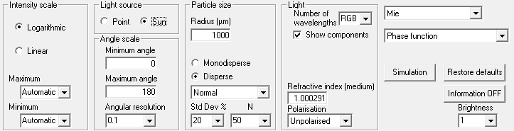
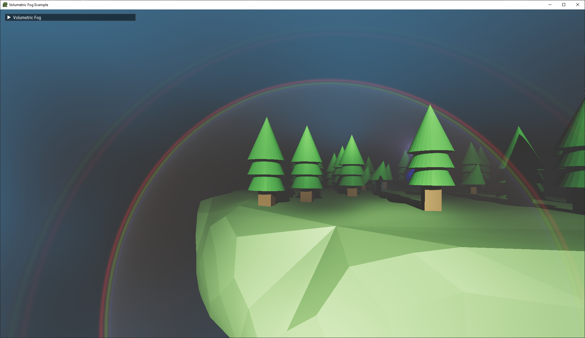

In computer graphics, Mie theory describes the interactions between light and large (relative to the wavelength of light) particles in a medium. Simulating it is crucial in rendering convincing volumetric effects like fog, clouds, and smoke.

This article is primarily aimed at graphics programmers who already have a volume renderer that has a pluggable phase function. In other words, this is a tutorial about producing phase functions that you can easily use in a volume renderer.

<!-- truncate -->
## Phase Functions

[Phase functions](https://www.pbr-book.org/3ed-2018/Volume_Scattering/Phase_Functions) are used to quantify the amount of light that this light is [scattered into](https://pbr-book.org/3ed-2018/Volume_Scattering/Volume_Scattering_Processes#In-scattering) the subject ray (such as a camera ray).

Real phase functions are extremely complex. For example, take this phase function for fog generated by MiePlot:



The graph essentially depicts the distribution of light when it collides with a particle. It's kind of like the volumetric equivalent to a [BRDF](https://en.wikipedia.org/wiki/Bidirectional_reflectance_distribution_function).

Analytical approximations for real-time applications exist, but miss high-frequency information that is essential for capturing effects like [fog bows](https://en.wikipedia.org/wiki/Fog_bow) (blue) and [glories](https://en.wikipedia.org/wiki/Glory_(optical_phenomenon)) (green).



To recover some of these features, a more complex approximation might layer multiple simpler approximations or use a bespoke polynomial. However, even those can't capture everything we care about without excessive runtime costs. What we need is a way to precompute the phase function and store it in memory.

## MiePlot

[MiePlot](http://www.philiplaven.com/mieplot.htm) is a program for simulating light scattering with Mie theory. With it, we can compute high-quality phase function LUTs for various atmospheric phenomena such as rain, fog, clouds, and smoke.

## Procedure

The basic procedure we'll be using to generate Mie scattering LUTs will be the following:

1. Set simulation parameters in MiePlot, then generate a plot
2. Save the plot to a file
3. Lightly process the data in spreadsheet software (this step could be done in your app as well)
4. Load the processed data in your app, then normalize it with Monte Carlo integration
5. Sample the LUT in your atmosphere simulation

## Fog

To simulate "typical" foggy conditions, configure MiePlot as such:



- To set the medium, go to Advanced -> Refractive Index -> Surrounding medium -> Air -> 5°C, 101325 Pa.
- In Particle size, use the first drop-down menu to change Normal to Gamma, then select the first equation to get the shape below.

A graph on the right will show the particle size distribution.



With these parameters, I'm trying to recreate the continental fog distribution presented in [Typical droplet distribution for different kinds of fog](https://www.researchgate.net/figure/Typical-droplet-distribution-for-different-kinds-of-fog_fig1_243483550).

Finally, click "New plot" to generate data.

After some time, the plot should generate and look something like this:



To save the results, go to File -> save numerical results as text file.

## Processing the data

Open the file containing numerical results, then locate the raw RGB data in the section following this header:
`Angle	Wavelength	Perpendicular	Parallel`

There should be several thousand lines of data. Copy them them into spreadsheet software like Microsoft Excel or Google Sheets. Average the third and fourth columns (containing perpendicular and parallel polarized light phase functions) into another column (I'm told this is equivalent to unpolarized light, which is what the sun emits).


We only care about the new column, so the others can be deleted. With a single column of data remaining, save the workbook as a csv.

## Loading the data

The csv format makes loading our data very easy:

```cpp
std::ifstream file{"mie.csv"};

std::vector<glm::vec3> data;
data.reserve(2000); // Reserve some space to minimize copying

while (file.peek() != EOF)
{
    std::string num0, num1, num2;
    std::getline(file, num0);
    std::getline(file, num1);
    std::getline(file, num2);

    float red   = std::stof(num0);
    float green = std::stof(num1);
    float blue  = std::stof(num2);

    data.emplace_back(red, green, blue);
}
```

Unfortunately, we aren't done yet. MiePlot's documentation states that the phase function is normalized to 4pi, so that integrating it as such will give the following result:
$$\frac{1}{4\pi} \int_{0}^{2\pi} \int_{0}^{\pi} f(\theta, \phi) \sin(\theta) \, d\theta \, d\phi = 1$$
However, when we numerically perform this integration ourselves, we get a very tiny result (around 1e-8). I don't know if this is caused by an error on my or MiePlot's part, but I do know a  cheeky way to fix it.



Performing the integration ourselves gives a number with which we can normalize the data:

```cpp
// Lambda: samples the phase function LUT with linear interpolation.
auto SamplePhaseLut = [&](glm::vec3 dir) -> glm::vec3 {
    auto cosTheta = clamp(dot(dir, {0, 0, 1}), -1.0f, 1.0f);
    auto theta = acos(cosTheta);      // [0, pi]
    auto uv = theta / M_PI;           // [0, 1]
    auto tc = uv * (data.size() - 1); // [0, size - 1]
    return mix(data[(size_t)floor(tc)], data[(size_t)ceil(tc)], fract(tc));
};

// Integrate surface of unit sphere with uniformly distributed random directions.
constexpr size_t samples = 1'000'000;
glm::dvec3 estimate = {};
for (size_t i = 0; i < samples; i++)
{
    const auto xi = glm::vec2(PCG_RandFloat(seed), PCG_RandFloat(seed));
    estimate += SamplePhaseLut(MapToUnitSphere(xi)) / UniformSpherePDF();
}
estimate /= samples;

// Normalize the data.
for (auto& c : data)
{
    c /= estimate;
}
```

`UniformSpherePDF` and `MapToUnitSphere` look like this:

```cpp
float UniformSpherePDF()
{
    return 1.0f / (4.0f * M_PI);
}

// Uniformly maps the unit UV square in [0, 1] to the surface of the unit sphere.
glm::vec3 MapToUnitSphere(glm::vec2 uv)
{
    float cosTheta = 2.0f * uv.x - 1.0f;
    float phi = 2.0f * M_PI * uv.y;
    float sinTheta = cosTheta >= 1 ? 0 : sqrt(1.0f - cosTheta * cosTheta); // Safe sqrt
    float sinPhi = sin(phi);
    float cosPhi = cos(phi);

    return {sinTheta * cosPhi, cosTheta, sinTheta * sinPhi};
}
```

`PCG_RandFloat` is a simple RNG based on [PCG](https://www.pcg-random.org/index.html), but it could be any function that generates a uniformly distributed pseudo-random float in \[0, 1].

I suggest testing your normalization by plugging in a known-good analytical phase function like Henyey-Greenstein or Schlick's. These integrate to 1 and so don't require hacky normalization:

```glsl
float phaseHG(float g, float cosTheta)
{
    return (1.0 - g * g) / (4.0 * M_PI * pow(1.0 + g * g - 2.0 * g * cosTheta, 1.5));
}

float phaseSchlick(float k, float cosTheta)
{
    float denom = 1.0 - k * cosTheta;
    return (1.0 - k * k) / (4.0 * M_PI * denom * denom);
}
```

After normalizing the data, we can put it into a 1D texture.

## Sampling the LUT

We only need to keep in mind that the our LUT-based phase function is parameterized by theta (unlike HG and Schlick above). Here's how you might access it in GLSL:

```glsl
layout(binding = 0) uniform sampler1D s_phaseFunction;

vec3 phaseLut(float cosTheta)
{
    float theta = acos(clamp(cosTheta, -1, 1));
    float u = theta / M_PI; // [0, pi] -> [0, 1]
    return textureLod(s_phaseFunction, u, 0).rgb;
}
```

If integrated correctly, your volume renderer should produce a result similar to that of [my single-scattering renderer](https://github.com/JuanDiegoMontoya/Fwog/blob/main/example/04_volumetric.cpp):


Looking in the other direction reveals the sun. A sun disk is not explicitly rendered in this scene:



## Premade Phase Function LUTs

Provided are some lightly processed LUTs. The code for loading and normalizing them still applies.

- [Fog phase function from above](mie_fog.csv)

- [Cumulus cloud phase function](mie_cumulus.csv)

- [Rain phase function](mie_rain.csv)


The rain phase function was used to generate the following image:



Note that the fog and rain parameters were chosen after a brief search for their respective particle size distributions and trying to match the graphs I found. Other parameters can yield perfectly valid results matching those descriptions.

## Issues

A critical assumption made early on is that the data generated by MiePlot uses sRGB primaries. In reality, we only have the phase functions for light of wavelengths 650nm, 510nm, and 440nm.


We assume that 650nm, 510nm, and 440nm correspond to red, green, and blue sRGB primaries, respectively, missing significant energy from other wavelengths that would have been emitted by the sun.

The incorrect appearance of the rainbow in the previous section is likely caused by this simplification. Despite that, it works well for small droplet media that produce nearly monochromatic scattering.

Radial banding or noise artifacts may appear when there isn't enough angular resolution or particle size samples. Increasing these in MiePlot will make plots take longer to generate (and in the case of angular resolution, increase the size of the data), but improve the quality of the LUT.

## Next Steps

Improving the color rendering of our LUTs will require a round of spectral integration to produce proper tristimulus sRGB values. A second post describing how to do this may be released once I understand the math and figure out how to coax MiePlot into doing my bidding.

## Links

Droplet distributions:

https://www.researchgate.net/figure/Typical-droplet-distribution-for-different-kinds-of-fog_fig1_243483550

https://www.researchgate.net/figure/Raindrop-Size-Distribution-RSD-of-tropical-cyclone-rainfall_fig1_279199640

https://en.wikipedia.org/wiki/Raindrop_size_distribution

Analytical phase functions:

https://cs.dartmouth.edu/~wjarosz/publications/dissertation/chapter4.pdf

https://www.desmos.com/calculator/thqhfqahfp