<iframe width="560" height="315" src="https://www.youtube.com/embed/IvWbIPyqE0s?si=UYAO5G_5GIMXxY7Z" title="YouTube video player" frameborder="0" allow="accelerometer; autoplay; clipboard-write; encrypted-media; gyroscope; picture-in-picture; web-share" referrerpolicy="strict-origin-when-cross-origin" allowfullscreen></iframe>

Described as "the most important numerical algorithm of our lifetime", the FFT has applications in a plethora of domains.

In this article I show how to run an FFT in Nabla, talk about different optimizations and showcase one application in graphics: FFT Bloom. 

<!-- truncate -->

## The Fast Fourier Transform

First, one must know what a Fourier Transform is. It's a clever way of decomposing periodic signals into their frequency components, essentially nothing more than an orthonormal change of basis. This might weird to think about, so here's a good intro to the topic by 3B1B:

<iframe width="560" height="315" src="https://www.youtube.com/embed/spUNpyF58BY?si=ZlJZDmq5fLnEkjnj" title="YouTube video player" frameborder="0" allow="accelerometer; autoplay; clipboard-write; encrypted-media; gyroscope; picture-in-picture; web-share" referrerpolicy="strict-origin-when-cross-origin" allowfullscreen></iframe>

Don't dwell too much on the continuous case because we're mostly interested in the [Discrete Fourier Transform](https://en.wikipedia.org/wiki/Discrete_Fourier_transform) (DFT for short). It's a center piece of Digital Signal Processing. As a quick summary, the DFT is nothing but a change of basis in some vector space. Given a signal defined over some domain (spatial or temporal, usually), the "natural" representation of it is its "canonical basis decomposition" - which means mapping each point in space or time to the signal's value at that point. Thanks to Fourier, we have another very useful representation for the same signal, which involves its "spectral decomposition" - periodic functions defined over certain domains can always be written as a linear combination of some special orthogonal (w.r.t. some metric) functions over the same domain. 

The DFT is a linear transform that maps an $n$-dimensional vector $x$ representing some periodic signal to another $n$-dimensional vector $X$ such that the coordinates of $X$ are the coefficients of the linear decomposition of $x$ in this special basis. Those of you familiar with linear algebra will probably immediately recognize this is just a change of basis, computed as a matrix product $D \cdot x$, where $D$ is the matrix associated with the linear transform (the DFT).

As posed, however, the DFT is a quite expensive operation: a matrix product is $O(n^2)$. That's where the Fast Fourier Transform (FFT for short) comes in! The Cooley-Tukey FFT (one of many FFT algorithms) exploits symmetries in the DFT's associated matrix to design a divide and conquer algorithm bringing its complexity down to $O(n\log n)$. There are actually a bunch of FFT algorithms that work in a similar fashion and achieve the same time complexity, but in this article we will restrict the discussion to the classic Radix-2 Cooley-Tukey algorithm, which is what we use in Nabla. 

The Radix-2 Cooley-Tukey FFT algorithm (from now on when I say FFT I will mean specifically this algorithm) is easier to implement than other FFT algorithms and maps nicely to the way parallelization is done in a GPU. The main drawback of it is that it only works on Power-of-Two sized (PoT for short) arrays. This requires us to pad any array we want to run an FFT on up to the next power of two. In some cases, it can result in a bunch of wasted compute power (worst cases have you wasting almost the same amount of compute as what you effectively actually need) but that's the price of convenience and simplicity, especially regarding the use of GPU hardware. Still, it runs pretty fast :).

Now you might be asking, why would I care about computing the DFT really fast? Well, there's a lot of operations that are accelerated with the FFT. One of those, as you might have guessed from the title of this article, is convolution.

## Convolution and The Convolution Theorem

The convolution of two signals $f$ and $g$, denoted by $f * g$, is a special type of product. My favourite way of reasoning about it (and one I have surprisingly very rarely come upon) is that it's just the superposition of many copies of $f$: for each point $x$ in your space, you take a copy of $f$ centered at $x$, $f(t-x)$ (as a function of a parameter $t$), and scale it by the value of $g$ at that point, $g(x)$, then sum all of these copies together. 3B1B again has a great introductory video, although he presents convolution in a more "standard" way, which is by sliding inverted copies of one signal over the other: 

<iframe width="560" height="315" src="https://www.youtube.com/embed/KuXjwB4LzSA?si=8Ma-72OlJ_m-0r3_" title="YouTube video player" frameborder="0" allow="accelerometer; autoplay; clipboard-write; encrypted-media; gyroscope; picture-in-picture; web-share" referrerpolicy="strict-origin-when-cross-origin" allowfullscreen></iframe>

[The Convolution Theorem](https://en.wikipedia.org/wiki/Convolution_theorem#Periodic_convolution) states that we can perform a (circular) convolution as a Hadamard (element-wise) product in the spectral domain. This means that convolution goes from an $O(nm)$ operation ($n$ being the number of pixels of a signal and $m$ being the number of pixels of a filter) down to $O(n \log n)$ (assuming $n \ge m$): You do Forward FFT, then Hadamard product, then Inverse FFT, with the FFTs being $O(n \log n)$ and the product being $O(n)$. For small filters the FFT convolution ends up being slower, but for larger ones the speedup is massive.

Our Lead Build System and Test Engineer, Arkadiusz, has a Vulkanised talk giving a recap of the Convolution Theorem and the usage of the FFT in Nabla: 

<iframe width="560" height="315" src="https://www.youtube.com/embed/Ol_sHFVXvC0?si=qmAz8XLshpGIKFr0&amp;start=271" title="YouTube video player" frameborder="0" allow="accelerometer; autoplay; clipboard-write; encrypted-media; gyroscope; picture-in-picture; web-share" referrerpolicy="strict-origin-when-cross-origin" allowfullscreen></iframe>

## FFT Bloom

[Bloom](https://en.wikipedia.org/wiki/Bloom_(shader_effect)) is a visual artifact in imaging. Bloom in Computer Graphics can be simulated as a post-processing effect by convolving an incoming image with a point spread function (PSF) which, as its name implies, spreads light from each pixel (point) all over the image. With my view of the convolution, convolving the image with a PSF means that at each pixel of the image you "paste" a scaled copy of the PSF, then sum all of them together. The PSF is a non-negative function that integrates to $1$ which is very strong towards the center and decays rapidly towards the edges. 

"Pasting" a copy of a PSF at pixel $p$ of the resulting convolved image, scaled by the value of the original image at pixel $p$, essentially has the effect of leaving much of the original pixel's light close to where it originally was, but also spreading some of it througout the rest of the pixels affected by this copy of the PSF. 

Even though convolution is commutative, it is common to distinguish when performing one the signal we're interested in (in this case, our image) from the *kernel* we're convolving it against (in this case, the PSF). Therefore, whenever you read the word *kernel* in this article, remember we're talking about an image / texture representing our PSF and NOT a program running on the GPU. 

Since Bloom is done with a convolution, and we're considering pretty big PSFs (think `256x256` or `512x512`) we set out to accelerate the convolution with FFT (if you were using smaller kernels such as `3x3` or `5x5` you'll be better off with doing the convolution in the spatial domain). The algorithm to perform FFT Bloom is roughly as follows:

```
1. compute the spectrum of the kernel via FFT
2. compute the spectrum of the image via FFT
3. compute the Hadamard product of both spectra
4. compute the IFFT of the resulting product
5. FFTShift the result 
```

Here's what convolving this image 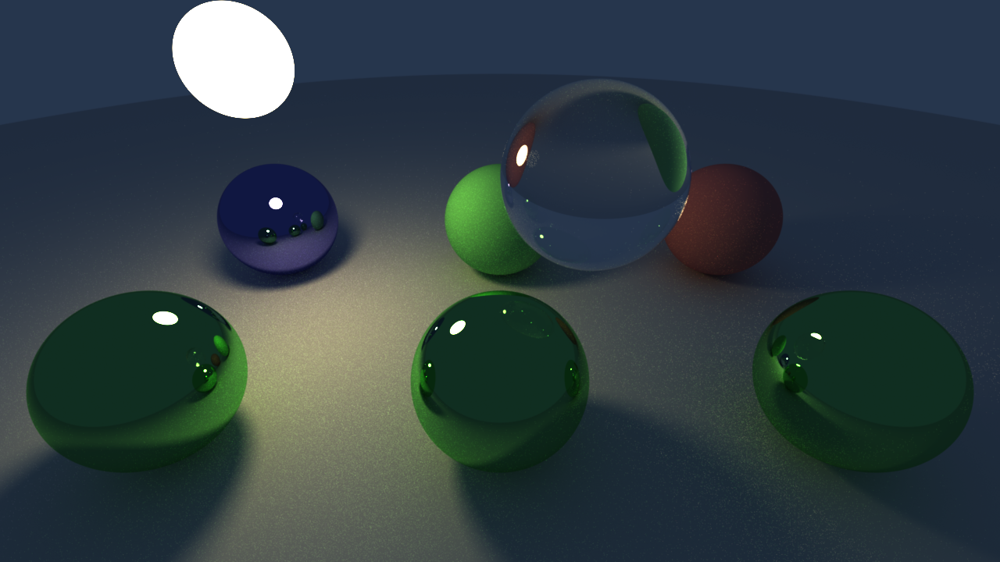 against this kernel


looks like: 

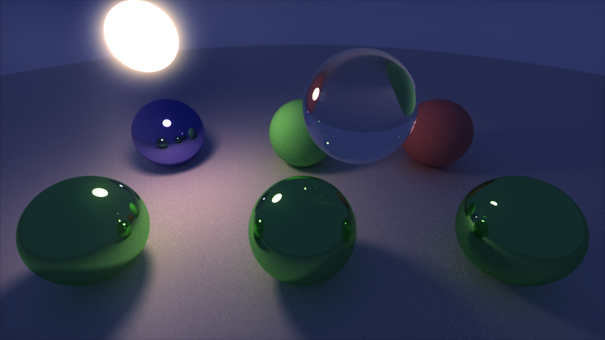

I'm showing the kernel with a white point of $10^{-6}$ so you can appreciate its shape, but its actually a PSF that's super strong in the middle and rapidly decaying towards the edges. For reference, here's the same kernel with a white point of $10^{-4}$:


The spectra of both signals are computed on a per-channel basis, meaning that we compute one spectrum for each of the R,G,B channels, since convolution is performed on each channel independently.

Since the DFT is separable over Euclidean domains, the spectrum of each signal is computed by performing the FFT along one axis at a time. This is important when we consider optimizations.

### Padding

One important detail about the FFT accelerated convolution we must not overlook is that it uses what's known as a circular convolution - in English, it assumes our signals are periodic (sampled with `GL_REPEAT`). If you were to naively compute both spectra as they come, multiply them then run the IFFT back, you'd find artifacts such as this:

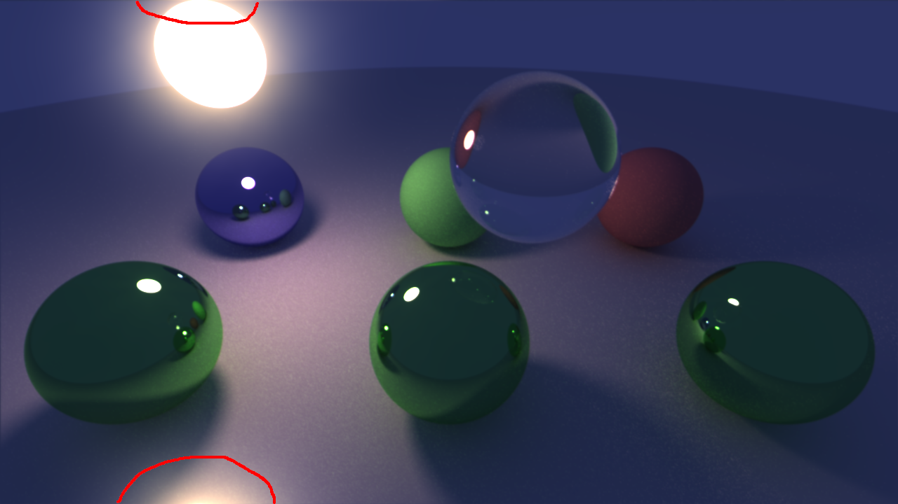

What's going on is that, since we assume the image to be periodic, any light that would "spill over" from the top of the image ends up wrapping around and contaminating the pixels below. Essentially it's equivalent to padding the image with `GL_REPEAT`, convolving the result with the kernel, then keeping the central pixels. Here's a neat visualization for that:

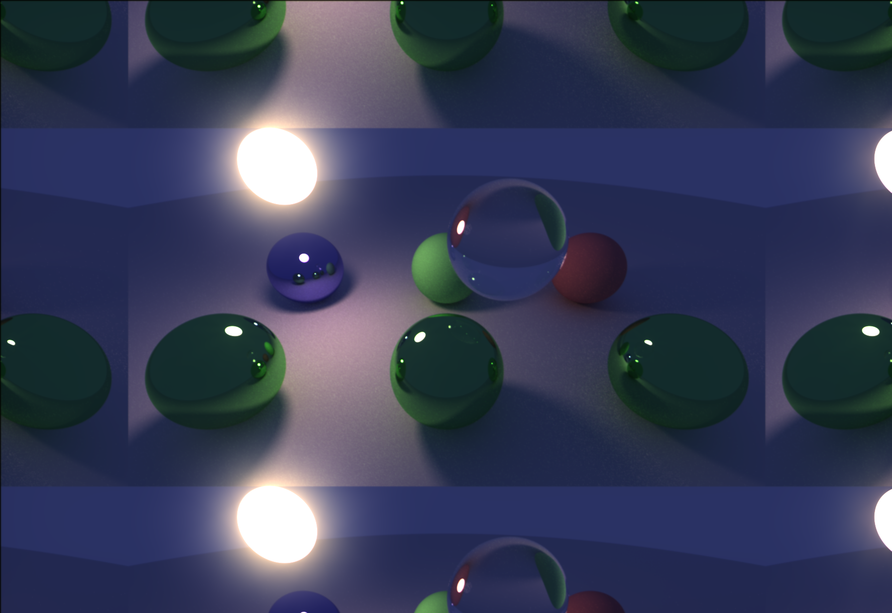

To avoid this kind of artifact, one must first pad the image with at least half the kernel size on each side so that the image is now bigger and this "spillover" happens only in the padding pixels, which get cut off when we go back to the original image dimensions. Wrapping modes that make sense here are mirror padding and zero padding. 

Mirror padding has the nice property that total luminance in the image is (kind of) preserved: take a pixel $p$ such that when "pasting" a copy of the kernel at its location, some pixels of this kernel copy end up in the padding. This is luminance lost due to it being pixels that get cut off from the end result. But for each one of those pixels in the padding, when pasting a kernel copy over them, some of that copy overlaps $p$, adding back some lost luminance. If the kernel was perfectly radially symmetric, this would mean no lost luminance. In practice it means a very slight variation in luminance.

However, mirror padding can cause artifacts such as this when there's pixels that are too bright near the borders: 

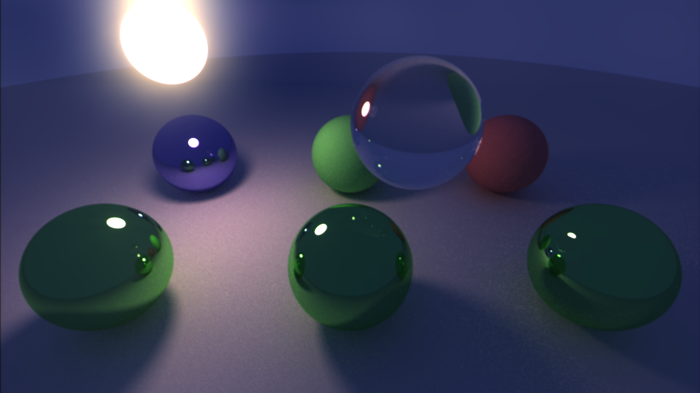

As you can see with the "Sun" ball there, there's an abnormal amount of light towards the border. This is because a "copy" of the Sun is spawned right on the other side of that border and a lot of light from it is contaminating the pixels below:

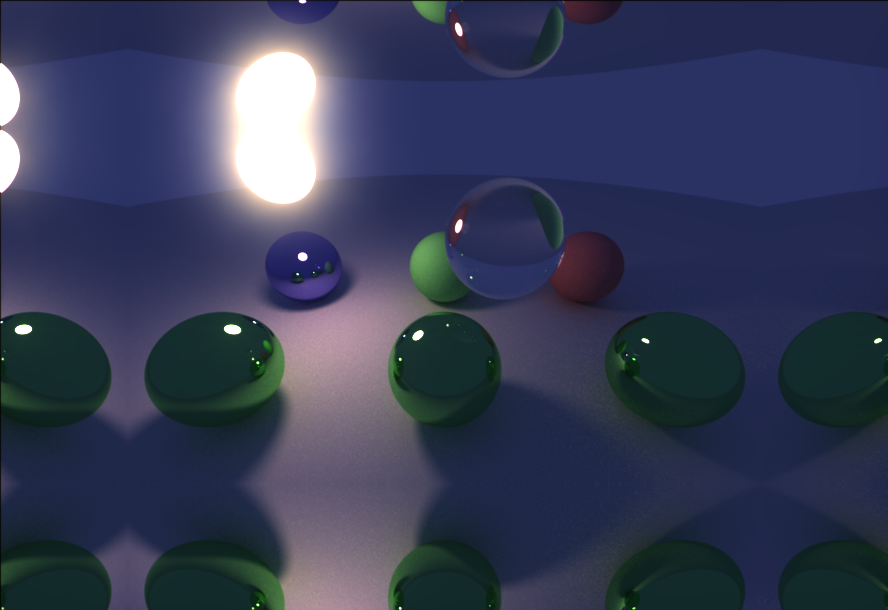

Zero padding is much nicer and it's what's used in the video at the start of this article. We do lose some luminance (since light spilling over to the padding zone is not compensated for) and given the shape of the PSF, pixels near the border lose much more luminance, which can turn the borders of the image darker. This vignetting effect is actually desirable (often added as a post-process), all the while avoiding artifacts like the one showcased for mirror padding. Furthermore, autoexposure methods handle the lost luminance in the image. 

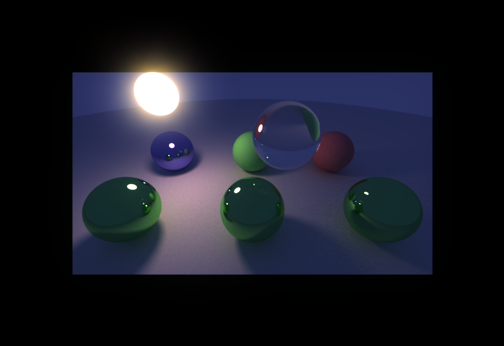

### The FFTShift

Why do you need to "FFTShift" the result, and what even is the FFTShift? First, let's get the following undiscussed step out of the way: the Hadamard product. 

To compute the Hadamard product, both matrices must have the same dimensions, which is almost never the case. We'll talk about the optimization done in our example later, but for now you can think that instead of the kernel $K$ for the convolution we're using another kernel $K'$ which has the same dimensions as our image and consists of a copy of $K$ in the centre, and zero padding all around it. The result of the convolution between our image and $K'$ is the same as the convolution with $K$, except for a lot of zero padding to the sides:


The DFT assumes the "origin" of our signal is the "top-left" or "bottom-left" element of the signal, depending on which coordinate you set as $(0,0)$. This is true for both image and kernel.

In practice what this means is that for each pixel $p$ in our image the convolution is still doing this process of "pasting" a scaled copy of the kernel, but instead of being centered at that pixel's location we paste a copy that has its $(0,0)$ position at $p$. 

Here's a comparison between pasting a centered copy (left) vs pasting a copy starting at $(0,0)$ (when the origin is set to be the top left of the image):


where $p$ would be the red pixel. When you convolve using the DFT, you're actually using the "pasting" method on the right. Furthermore, since both image and kernel have the same size, what's going to happen when pasting kernel copies in this manner is that a bunch of pixels from some copies will go into "the padding area" and wraparound to the other side of the image. 

Due to the way this pasting works, the wraparound only happens in one direction for each axis. For example if $(0,0)$ is the top-left corner as the example above, wraparound can only happen from pixels being too far to the right or too far below. But no matter where $(0,0)$ is, if it's a corner of the image (which is what convolution via DFT assumes) the result will be the same.

The result of doing the convolution in this way is the following:

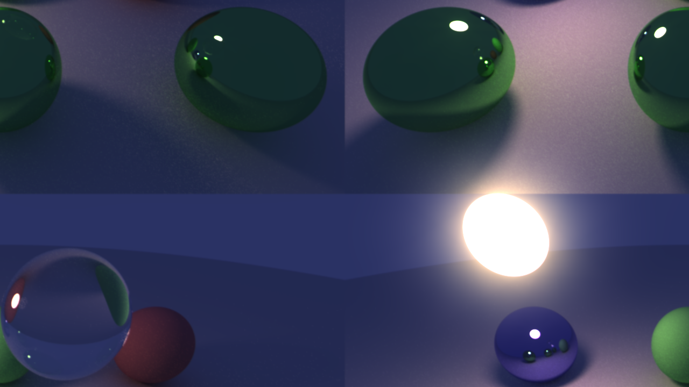

So one possible fix is to take that image and apply what's colloquially known as the FFTShift: For each axis, swap halves around. You can see in the image above if you swap the upper half with the lower half and then swap the left half with the right half, you'll get the correct result (in this case there was no padding to simplify stuff so you'll still see the wraparound artifact we talked about before). 

An equivalent "fix" would be to apply the FFTShift to either the kernel or the image before computing their spectrum. When shifting the kernel, for example, the effect is that the center of the kernel ends up at $(0,0)$:


This is still the same kind of expensive, because it's a shift of $K'$ which has the same dimensions as the output image. If you're precomputing the kernel just once, however, it's totally fine

Much cheaper, however, is a trick that computes the effect of the FFTShift in the spectral domain. The [Time Shift property](https://en.wikipedia.org/wiki/Fourier_transform#Time_shifting) of the Fourier transform
lets us compute the FFTShift right after computing the spectrum of the kernel. In the discrete domain this property becomes the [Shift Property](https://en.wikipedia.org/wiki/Discrete_Fourier_transform#Shift_theorem) of the DFT.

Essentially, along an axis with length $N$, we're shifting all elements by $\frac N 2$ to either the left or right: it's the same because the signal is periodic, so you move the whole axis $\frac N 2$ to either side and the half that falls outside the range $[0, N-1]$ just wraps around to the other side. Since $2 \pi$ is a whole period of our signal and we're shifting it by half a period, the result in space of this shift yields

$\mathcal F (\text{FFTShift(x)})_k = e^{- i \pi k} \cdot \mathcal F(x)_k$

in the spectral domain. Since this is done for each axis, the result is essentially the same as the Hadamard product   
$M \cdot \mathcal F(K')$ of the matrix $M$ and the spectrum of the kernel $\mathcal F(K')$, where  
 $M_{xy} = (-1)^{x+y}$ (due to the particular form the complex exponentials take along each axis). 
 
 This doesn't even have to be computed as a product in practice, you can just flip the sign of the odd positions (those whose coordinates sum to an odd number) in $\mathcal F(K')$ as you compute it.

## Optimization 1: Exploiting the Hermitian Symmetry of the spectra of real signals

[The DFT of a real sequence is Hermitian](https://en.wikipedia.org/wiki/Discrete_Fourier_transform#DFT_of_real_and_purely_imaginary_signals), meaning that if $\text{DFT}$ is the DFT of a sequence of real numbers $f$, then it satisfies $\text{DFT}[T] = \text{DFT}[-T]^*$ ([click here](https://kovleventer.com/blog/fft_real/) if you don't get the notation.) 

Once again, here's Arkadiusz talking about this:

<iframe width="560" height="315" src="https://www.youtube.com/embed/Ol_sHFVXvC0?si=1ke5LgxKgDwQ-iEL&amp;start=513" title="YouTube video player" frameborder="0" allow="accelerometer; autoplay; clipboard-write; encrypted-media; gyroscope; picture-in-picture; web-share" referrerpolicy="strict-origin-when-cross-origin" allowfullscreen></iframe>

This has two important implications: first, that after performing the FFT of a real signal, we only need to store half of the values, since the other half are redundant. The values we store for a sequence of length $N$, for even $N$, are those indexed $0$ through $\frac N 2$, where the latter is commonly known as the Nyquist frequency. 

"But hold on a second. Those are actually half plus one values of the resulting DFT" an observant reader might say. But worry not, a nice property of even-length sequences is that $-i$ is always part of the group of roots of unity that participate in computing the FFT. An implication of this is that both $\text{DFT}[0]$ and $\text{DFT}[\frac N 2]$ are real-valued for the DFT of a real signal, which lets us pack both elements together in a single complex number as $\text{DFT}[0] + i \cdot \text{DFT}[\frac N 2]$. 

The other important implication is explored in the link to [kovleventer's blog](https://kovleventer.com/blog/fft_real/) above. If you think about it, you are performing the FFT of a sequence of $N$ real numbers and keeping $\frac N 2$ complex numbers, which is the same amount of real numbers. But the FFT takes $N$ complex numbers as input and gives $N$ complex numbers as output, so we're wasting half of our compute! 

Thankfully, the hermitianicity (hermiticity?) of the DFT of real signals and the linearity of the DFT allow us to exploit the computation: we can pack two real signals $x,y$ into a single complex signal   
$z = x + iy$, compute $Z = \text{DFT}(z)$, and then used the rules explored in that blog post to retrieve  
$X = \text{DFT}(x), Y = \text{DFT}(y)$. We call this process packing and unpacking.

Also, from the first important implication, we notice that we don't have to unpack the whole of $X$ and $Y$, so we limit ourselves to only unpack the lower half (indices $0$ through Nyquist) of each.

So to perform the FFT on the first axis (considering a single channel), we pack together two rows or columns of the image (depending on which axis we're running the FFT along first), compute the FFT of this packed signal and then unpack and save half of each. Then, we run an FFT along the other axis along the result. 

Say you did this on an $N \times M$ image, for even $N$ and $M$, running it along the $x$ axis first (so packing rows together). The result has a size of $\frac N 2 \times M$ (saving half of each row). So when running the FFT along the $y$ axis, you'd only need to consider $\frac N 2$ columns instead of $N$! You can rest assured that the FFT of the "implicit" rows is redundant to compute: the implicit columns are exactly the complex-conjugate of one of the columns we do compute the FFT of, so [this property](https://en.wikipedia.org/wiki/Discrete_Fourier_transform#Conjugation_in_time) ensures that we can reconstruct their FFT easily (and as a consequence, we have the result that Arkadiusz showcases).

This packing/unpacking is also useful when doing IFFT on the way back: given   
$X = \text{DFT}(x), Y = \text{DFT}(y)$ where we know $x,y$ are real signals, then we can once again pack   
$Z = X + i \cdot Y$, compute $z = IDFT(Z)$, and then unpack $x,y$ with a much simpler rule:  
$x = \text{Re}(z), y = \text{Im}(z)$

Another optimization done here is that after running the FFT along the first axis, we saved all of the Zero and Nyquist frequencies packed together into a single scanline. So, when running the FFT along the second axis, we compute this scanline with a special rule considering that it's the FFT of two packed real signals.

## Optimization 2: Single element trade after an FFT butterfly

The Cooley-Tukey Radix-2 FFT is performed with $k$ stages for a sequence of length $N = 2^k$. There's also two complementary ways of computing the DFT with this algorithm: Decimation in Time (DIT) and Decimation in Frequency (DIF).
In Nabla, our forward FFT implements the DIF algorithm, while the inverse FFT implements the DIT algorithm + normalization. Each one of these returns the output in some nonstandard order (more on that later). Furthermore, running one after the other (in either order) results in the identity function.

Here's a visualization of the DIF algorithm for a sequence of length $8$:


At each stage, each cross is called a butterfly. Each cross has two inputs (the two circles on the left) and two outputs (the two circles on the right). The outputs of the butterflies become inputs for the butterflies of the next stage. I won't go into too much detail of how each butterfly is computed, go check out the FFT algorithm for those details if you're interested.

An important thing to notice here is that each stage computes twice the FFTs as the previous stage, each with half the length, and terminating when the FFT is of length two with a single butterfly per FFT. In fact, this is exactly the point of the FFT: it's a divide-and-conquer type of algorithm. For example, if you take only the top half of the diagram starting from stage $2$ onwards, that's exactly a DIF diagram for a sequence of length 4. The same can be said about the lower half, of course. 

Since we have the diagram at hand, let's also introduce the "stride". Each stage has an associated stride, which is simply the distance (in lanes) between the elements participating in a butterfly. For example, in stage $0$ this stride is $4$, since butterflies happen between elements $4$ lanes apart. The starting stride is always $\frac N 2$ for a sequence of length $N$, and each stage's stride is half the stride of the previous stage.

In the diagram above, to compute the FFT of a sequence of length $8$ first we perform some butterflies to prepare the input for the next stage, and then the next stage runs two FFTs on sequences of length $4$ independently. Each of these FFTs, in turn, does the same: perform some butterflies as input for stage $3$, then run two FFTs on sequences of length $2$ independently.

How do we map this to hardware? Well, we notice that the number of butterflies per stage is constantly $\frac N 2$. In our implementation, we make threads compute a single butterfly each at each stage. That means that we launch $\frac N 2$ threads, with thread of thread ID $n$ in charge of computing the $n$th butterfly, when counting butterflies from the top. So at stage $1$, for example, thread $0$ is in charge of computing the butterfly between its inputs $x[0]$ and $x[4]$, and thread $2$ would be in charge of computing the butterfly between inputs $x[2]$ and $x[6]$. 

Now let's look at stage $2$. The first butterfly of stage $2$, with index $0$ counting from the top, has to be performed by thread $0$. But to do this we require the first of thread $0$'s output of the previous stage, and the first of thread $2$'s output. Similarly the third butterfly, with index $2$, has to be performed by thread $2$ with the second outputs of the same butterflies. 

For easier nomenclature we say that each thread at a certain stage holds two elements "lo" and "hi". These are the elements participating of a butterfly: the one closest to the top of the diagram is "lo", and the other is "hi" (could be counterintuitive but it's because we count from the top). Since butterflies are performed in-place "lo" and "hi" can either be the inputs or the outputs of the butterfly, depending on at which moment (although in the same stage) you are inspecting them. So with this nomenclature, thread $0$ at stage $2$ needs its own "lo" and the output "lo" of thread $2$ at the previous stage to compute its butterfly, and similarly thread $2$ needs to do the same but with the "hi"s. 

It turns out that at each stage, thread $x$ must use one of its own outputs of the previous stage and one of the values of thread $x$ \^ $\text{stride}$, where we consider the stride of the current stage. For example at stage $2$ the stride is $2$ and we can see that the pairs exhchanging ther elements $((0,2)$ and $(1,3))$ can be obtained from one another by XORing their threadID with the current stride. The same thing happens at stage $3$ with a stride of $1$. 

Once a thread has figured out with which other thread it must exchange a single value, it must also figure out whether to keep its "lo" and exchange its "hi" or vice-versa. As it turns out, the thread of lower ID exchanges its "hi" and the thread of higher ID exchanges its "lo". You can see this being true in the DIF diagram as well. To figure out whether a thread is the one of lower or higher ID in the pair, just check whether `threadID ^ stride` is nonzero, since stride is always a power of two (the result is $0$ for the thread of lower ID and nonzero for that of higher ID).

If that gets hard to visualize, here's the same diagram with each node colored according to which thread is holding that element at that point in time. Thread $0$ is blue, $1$ is red, $2$ is green and $3$ was left white. You'll have to excuse my paint skills. Remember that for each thread, "lo" is always the elements closest to the top in the diagram, and the other is "hi".

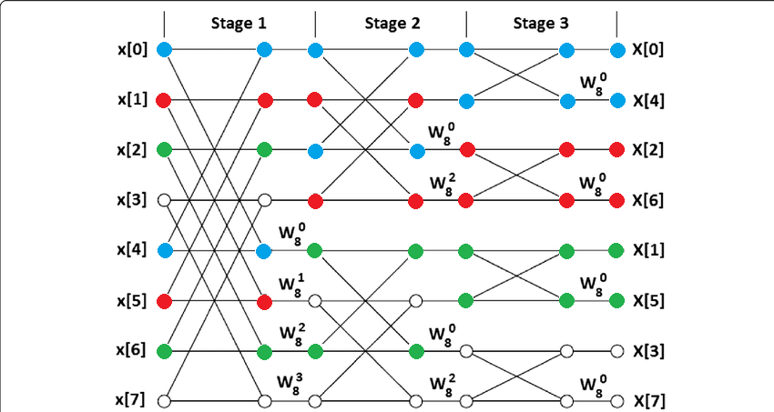

Another thing we get is optimal reading: think about the colored diagram again. We launched $4$ threads to compute it, but what's interesting is how they read their elements in. First, they will reads all their "lo" elements for the first stage, which are elements $0$ through $3$, and then they will reads all their "hi" elements which are $4$ thorugh $7$. If the input is contiguous in memory, we get coalesced reads!

## Optimization 3: Exploiting Shared Memory in Compute, subgroup operations and overcoming maximum Workgroup sizes with Virtual Threads

It turns out that not all FFTs are born equal: some are much easier to handle than others. The smallest size for an FFT we consider is $2 \cdot \text{SubgroupSize}$ where $\text{SubgroupSize}$ is the smallest possible number of threads your device can run in parallel in the same subgroup. We call such an FFT "Subgroup-sized".

Thus, each thread would hold two elements "lo", "hi" at all times and the DIF diagram (or DIT in the case of the inverse FFT) maps nicely to the hardware. If you want to compute an FFT for a sequence shorter than that, you must pad it to that size in whichever way you see fit.

This Subgroup-sized FFT is the fastest it can be, since all elements of the FFT can be made resident in registers and the element swaps we talked about in the previous section can be implemented as subgroup XOR shuffles, which is a SPIR-V intrinsic and modern GPUs usually have hardware to perform this shuffle operation fast.

What happens for bigger-sized FFTs? Well, up to $2 \cdot \text{MaxWorkgroupSize}$ (where $\text{MaxWorkgroupSize}$ is the maximum number of threads you are willing to launch in a single workgroup) you can still use the same exact DIF and DIT algorithms, but using shared memory to perform the shuffles. We call these FFTs "Workgroup-sized". We implement our own generic library for what we call workgroup shuffles: they perform the operation of swapping values between threads in the same workgroup, mimicking what subgroup shuffles do but at the workgroup level. 

To do this, we essentially have all threads in a workgroup write their elements to shared memory, barrier to make sure every thread is done writing, then make threads read their values from shared memory. It is slower than a subgroup shuffle since it involves barriering, but it's miles better in terms of latency than going through global memory. 

We only use this when necessary: for example, if running a forward FFT on a sequence of length $4 \cdot \text{SubgroupSize}$, only the first stage needs to do such a barrier. At the second stage we run two Subgroup-sized FFTs, which we established can be done by a single subgroup with subgroup shuffling. In the case of an inverse FFT (go look at a DIT diagram if you want), this order would be reversed and only the last stage would need a workgroup shuffle.

The advantages of using subgroup shuffles at the smallest level aren't just because of speed, but also because of the shared memory footprint: if you wanted to do such a shuffle fast using shared memory, you'd need to multiply the amount of shared memory by the number of elements in a shared memory bank to ensure every element ends up in a different bank, otherwise you WILL run into bank conflicts. So you avoid this memory/speed tradeoff altogether. 

What about a "bigger than Workgroup"-sized FFTs? For example, take a sequence of length $4 \cdot \text{MaxWorkgroupSize}$. With our algorithm, we'd need $2 \cdot \text{MaxWorkgroupSize}$ threads in a single workgroup to achieve this. That's where virtual threading comes in!

Virtual threading essentially consists of emulating many threads' behaviour using a single thread. For a visualization, say our $\text{MaxWorkgroupSize}$ was $2$ and we're running an FFT on a sequence of  
 $8 = 4 \cdot \text{MaxWorkgroupSize}$ elements like before. Here's the image again so you don't have to go fetch it.


This time however, there are only two real threads and four virtual threads. Thread $0$ manages virtual threads $0$ and $2$ (those which had elements tagged blue and green, respectively) and thread $1$ manages virtual threads $1$ and $3$ (red and white). The idea now is to divide the first stages into computations we can do sequentially until we recurse down to Workgroup-sized sub-FFTs (in this example this happens at stage $2$). 

Virtual threads can be grouped into "virtual workgroups". We see that after stage $1$ in the diagram above, virtual threads $0$ and $1$ must compute a Workgroup-sized FFT (the top half of the diagram starting from stage $2$) and the same thing happens for virtual threads $2$ and $3$. 

This gives us an idea of how to group virtual threads together, because after stage $1$ we can make our real threads compute two Workgroup-sized FFTs in sequence: once emulating virtual threads $0$ and $1$, and a second time emulating virtual threads $2$ and $3$, and each time using shared memory for shuffles since the size allows it. 

Computing stage $1$ is also easy: all butterflies are independent, even within the virtual workgroup, so you can compute them in any order. To keep things consistent we choose to emulate threads per virtual workgroup as well: in a first step, thread $0$ emulates the blue butterfly and thread $1$ the red butterfly (which are those for virtual threads $0$ and $1$) and then in a second step they do the same for the other two butterflies. 

There is no element swap after butterflies though: virtual threads read in their inputs and write out their outputs to the same place they had read their inputs from. Element swapping now happens indirectly: in the next stage, virtual threads figure out which elements they need to read in to perform their computations. What's also nice is that all these writes (and the reads that come afterwards) are all coalesced as well. 

Even better, all memory accesses done in stages previous to running a Workgroup-sized FFT are done in the same positions for different threads. What I mean by this is that even if virtual threads access different memory locations at each of these stages, *all memory locations accessed are owned the same thread*. You can see this in the diagram above: In stage $1$ thread $0$ owns memory locations $0,2,4,6$. After writing to these positions when computing the butterflies in that stage, it still owns those positions: virtual thread $0$ will need elements at positions $0$ and $2$ to run the Workgroup-sized FFT in stage $2$. 

Element at position $2$ was computed by virtual thread $2$, but since that virtual thread is also emulated by thread $0$, it's the same thread that owns that memory location! In practice this means that these computations don't require any sort of barriers, syncs or used of shared memory. This allows us to employ an optimization which is to preload elements per thread - essentially reading the needed elements for each thread only once at the start and keeping them in local/private memory for the rest of the algorithm. This will be explained in more detail in the Static Polymorphism section of this article.

All of this implies that such FFTs use the same amount of shared memory as a Workgroup-sized one. The downside is either increased latency or decreased occupancy, depending on whether these reads/writes happen in global memory or local/private (preloaded) memory.

This generalizes to arbitrary "bigger than Workgroup"-sized FFTs: Run all the butterflies in sequence in each "bigger than Workgroup" stage, reading and writing their inputs and outputs from and to the same place. Then once you get to Workgroup size, you can run the algorithm for Workgroup-sized FFTs that uses shared memory for faster swapping.

Our FFT code requires a bunch of template parameters to be called, among those we find `ElementsPerInvocation` and `WorkgroupSize` (it actually takes their base $2$ logarithm, given that they should be powers of two). This is to indicate that we're going to be performing an FFT on an array of size   
$N = \text{ElementsPerInvocation} \cdot \text{WorkgroupSize}$ and that this size should be known at shader compilation time. `ElementsPerInvocation` is the number of elements in the output that a single thread must compute. It is equivalent to twice the number of virtual threads each thread launched emulates. 

For $\text{ElementsPerInvocation} = 2$, for example, that'd be a single virtual thread per thread, which essentially is just running the best algorithm (using shared memory and subgroup ops for shuffles). For $\text{ElementsPerInvocation} = 2^k$ you'd have $2^{k-1}$ virtual threads per thread and $k-1$ stages where you must go through global memory because of thread emulation, and only the rest of the stages would use shared memory/subgroup ops for shuffles. 

You can of course decompose $N = 2^k$ as different products of $\text{ElementsPerInvocation}$ and $\text{WorkgroupSize}$. Our rule of thumb is to minimize $\text{ElementsPerInvocation}$ when possible (remembering it must be at least $2$) and only increasing it if the $\text{MaxWorkgroupSize}$ won't allow you to keep it smaller. This is to avoid going through global memory when possible if reading/writing straight to global memory, or maximize occupancy if we preload at the start.


## Optimization 4: Better occupancy and access latency with spilling preloading

To compute a per-channel spectrum in the Bloom example, we have a few different strategies:

One would be to load each channel at a time, compute the FFT for that channel, and store it. This sounds natural, and it's what we do in the Bloom example for intermediate FFTs. 
But for the first axis FFT, the problem is that each thread is essentially sampling the same spots in a texture once per channel, with a long computation (the FFT of the channel) in the middle , so the parts of the texture accessed are unlikely to be cached between loads (because of other workgroups working on the same SM). The same happens at the end, when doing IFFT along the first axis. This results in three texture writes per pixel, each time writing a different channel (AND having to retrieve the previous write before the next, since you can't just write to a single channel of a texture).

A different strategy would be to load all channels at once, having the values for all channels resident in registers. Although this means we're using more registers per thread, these can be spilled to global memory in the worst case, resulting in only some accesses to global memory. The upside is that each SM/CU/EU probably has its own spilling private memory arena so its faster than re-accessing a texture/buffer anyway.

Now that we have preloaded all channels, another important decision must be made: do we compute the FFT channel by channel or all at once? You see, just like you can define `complex_t<float32_t>` or similar, you could use `complex_t<vector<float32_t, 3> >` with operations done on a per-element basis. The number of operations remains the same for either three FFTs with `complex_t<float32_t>` or a single FFT with `complex_t<vector<float32_t, 3> >`, but what doesn't remain the same is the memory and memory barriers required to do so. 

Global memory accesses and subgroup shuffle ops remain the same in both versions. What's different is the behaviour regarding barriering.

If you used `complex_t<float32_t>` you'd have to do three FFTs, which at each stage where memory gets traded using shared memory incurs in a barrier. If you used `complex_t<vector<float32_t, 3> >` instead, you'd have a third of the shuffles (meaning a third of the barriers), trading three times as much memory on each. Sound good? Well the thing is that this requires triple the amount of shared memory per workgroup. You can spill registers, but not shared memory, so this would effectively kill occupancy.

In our bloom example, we choose to overbarrier but keep shared memory usage per workgroup lower.

This will become more clear when we talk about the Accessor pattern later on, but another important part of preloading is that (except for register spilling) we never need to go through global memory when doing an FFT, even if $\text{ElementsPerInvocation}>2$. 

## Optimization 5: Dynamic Kernel rescaling via Spectral Resampling

At the start of the article we talked a bit about the Hadamard product and that to perform such a product you'd need both spectra to be matrices of the same exact dimensions. Let's go over it again.

The result of the FFT of the image is of dimensions 
```cpp
roundUpToPoT(imageDimensions+kernelDimensions)
``` 
while the result of the FFT of the kernel has size 
```cpp
roundUpToPoT(kernelDimensions)
```
 
`roundUpToPoT` means to round each dimension up to the next power of two (remember this is needed by Cooley-Tukey) and the `+kernelDimensions` is there to account for padding to avoid wraparound artifacts.
To simplify the discussion a bit we'll also assume `kernelDimensions` is a square with PoT-side length.

So, how do we compute the Hadamard product? One thing you could do is create a `roundUpToPoT(imageDimensions+kernelDimensions)` image which has a copy of the kernel in the center and zero padding all around it, 
compute the spectrum of this and multiply the spectrum of the padded image with it. This works, and is probably optimal if you're considering running Bloom as a post-processing effect for a fixed-size image. It's what we did in the first section, which I introduced as a way to explain the FFTShift. 

However, it has a bigger memory footprint than our approach (presented in the next paragraph): this method has one padded kernel image per value of `roundUpToPoT(imageDimensions+kernelDimensions)`. To run this with images of varying 
sizes (where you might get different rounded up to PoT sizes) you'd need a different copy of the padded kernel per each possible value.

Our approach in Nabla is more aligned with other use cases we had for the FFT. What we do is compute the spectrum of the kernel as-is (no padding or anything) and keep it resident in GPU memory.
Then, once we have the spectrum of the image, to compute the Hadamard product we simply rescale the kernel's spectrum to `roundUpToPoT(imageDimensions+kernelDimensions)` by sampling it as a texture: to compute the 
product at pixel $p$, we get $p$'s `uv` coordinates in the image (essentially just divide $p$ by `roundUpToPoT(imageDimensions+kernelDimensions)`) and sample the kernel spectrum at those coordinates. 

This allows us to keep a single copy of the spectrum resident in GPU memory, with no padding (so it's as small as it can be) and reuse it for any convolutions we might want to perform.

What we're doing here is essentially zooming out in the spatial domain by resampling the spectrum. Once again, Arkadiusz's video does give a bit of insight into this as well.

<iframe width="560" height="315" src="https://www.youtube.com/embed/Ol_sHFVXvC0?si=dVlEwrkL2zm7s5Mi&amp;start=572" title="YouTube video player" frameborder="0" allow="accelerometer; autoplay; clipboard-write; encrypted-media; gyroscope; picture-in-picture; web-share" referrerpolicy="strict-origin-when-cross-origin" allowfullscreen></iframe>

Since we assume (and ir our Bloom example, require) the kernel to have PoT long sides (and square, but for this discussion it could also be rectangular) it turns out that `roundUpToPoT(imageDimensions+kernelDimensions)` is exactly an integer multiple of `kernelDimensions` 
(of course, it might be a different multiple per axis). Let's assume   

$\text{roundUpToPoT}(\text{imageDimensions}+\text{kernelDimensions}) = (N_1, N_2) \cdot \text{kernelDimensions}$. 

$N_1$ and $N_2$ also turn out to be PoT, but that's irrelevant.

What this all means is that the end result is not just any kind of resampling, but rather a pure (integer-factor) upsampling process. Our spectral interpolation is exacly equivalent to upsampling with a tent filter: that is, the result 
is exactly the same as introducing $N_1 - 1$ zeros between samples along the $x$-axis, $N_2 - 1$ zeros between samples along the $y$-axis, and then convolving the result with a tent filter whose finite support is exactly the length between two pixels in the original spectrum (the linear interpolation 
performed by hardware samplers is exactly the same as a convolution with a tent).

[Pure upsampling](https://en.wikipedia.org/wiki/Upsampling) in one domain causes periodic repetition of the signal in the other domain in the expansion step (introducing zeros between samples) before attenuating the repetitions in the interpolation step. Ideally we would like to annihilate the repetitions entirely using a perfect filter $(\text{sinc})$, since convolution with it in the spectral domain becomes a product with a box function in the spatial domain, one which would exactly enclose the central copy of the kernel and annihilate the rest. 

The interpolation with a tent filter, however, is equivalent to a product in the spatial domain with a $\text{sinc}^2$ function. This means that repeated copies of the kernel get attenuated, although not perfectly: copies of the kernel overlapping with secondary lobes of the 
$\text{sinc}^2$ will get scaled down (and by quite a lot) but not completely annihilated. This causes ringing artifacts. For example, here's the result of our convolution against a kernel of size `256x256` (using mirror padding to get as much luminance as possible):

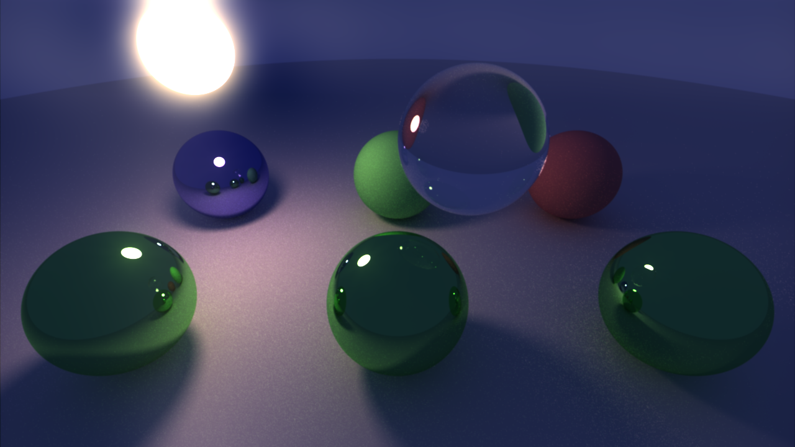

It might be hard to see, but there is some ringing going on in these areas:


To better showcase this, here's the same image with a white point of $0.25$:

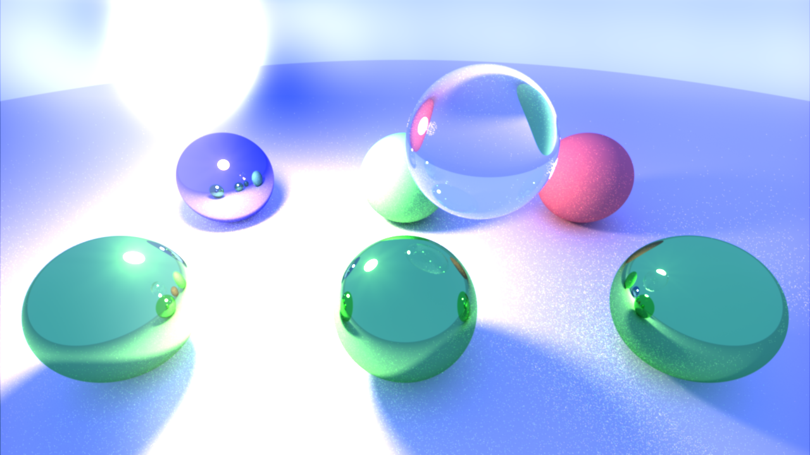

Look at the areas I circled in red before, and compare that to the same convolution performed with the other technique we mentioned at the start of this section (the one that first padded the kernel with zeros and 
then computed the spectrum of that), with the whitepoint set to $0.25$ as well:

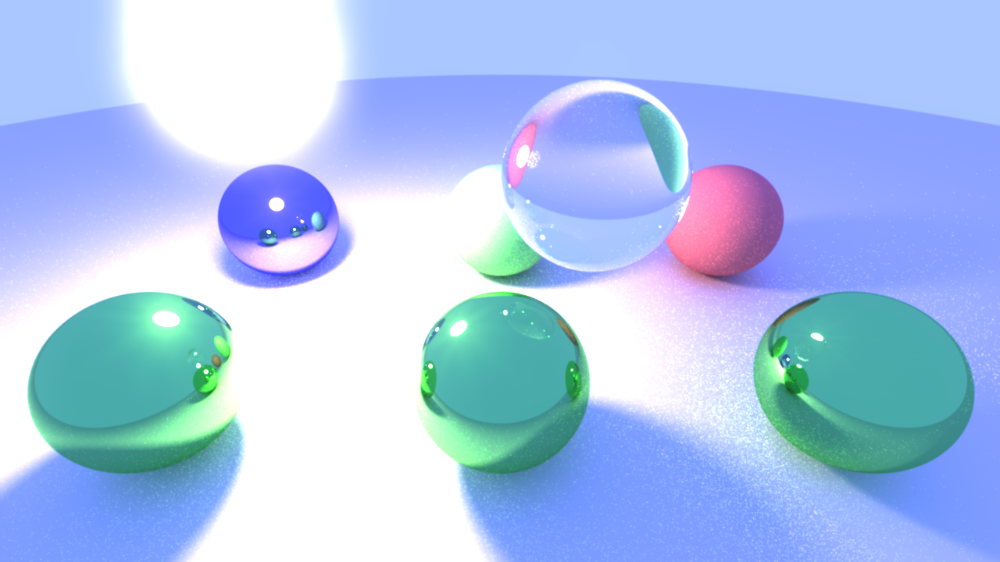

Here's how I visualize this in my mind: copies of the kernel pasted over the very bright pixels of the Sun (and all copies of the kernel everywhere actually, but these would be the relevant ones here) are actually 
at first (before the product with a $\text{sinc}^2$) repeated all over the image. But when the product with the $\text{sinc}^2$ happens:

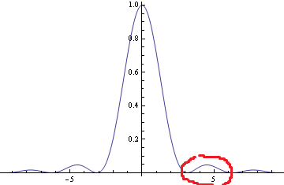

you can imagine that the big central lobe gets multiplied against the central copy, preserving it (especially towards the center, killing it off towards the edges). But the next copy gets multiplied against the secondary lobe (the one circled in red) and doesn't get completely annihilated (again, especially important towards the centre of the copy, where the kernel concentrates most luminance),
causing ringing artifacts. 

Arkadiusz's video on the timestamp above also showcases the spatial ringing of the kernel when doing this (albeit very exaggerated so you can see some of it).

To avoid this ringing, you can use a bigger kernel, since that makes $(N_1, N_2)$ smaller, meaning less zeros in the upsampling process, leading to less spatial repetition, leading to a more "compact" $\text{sinc}^2$,
which has smaller secondary lobes. Here's for example the result of doing our convolution against a kernel of size `512x512`, same whitepoint:


Some ringing still survives, but it's much less noticeable than before. Here's that image with whitepoint   
$1$, in case you want to compare it against the one we did with a `256x256` kernel:


An alternative would be to upgrade the Tent filter to a better approximation of the $\text{sinc}$ function. You can do this in any manner you want, but if you want the resampling to stay relatively fast by exploiting hardware bilinear sampling you will want to use polynomial fits of $\text{sinc}$. There's a [GPU Gems article](https://developer.nvidia.com/gpugems/gpugems2/part-iii-high-quality-rendering/chapter-20-fast-third-order-texture-filtering) on implementing a bicubic sampler using bilinear sampling, and the technique naturally extends to bi-whatever sampling (with exponential cost, however).

### Dynamic PSF Sharpening

Given the shape of the PSF we consider in this example, spatially rescaling the kernel is pointless. I have shown you an image of the kernel with a low whitepoint, but its actual distribution is kind of a very sharp 
Laplacian, so something like this: 


although much sharper. The kernel isn't perfectly radially symmetric with this distribution, but it's similar. A property such distributions have is that if you normalize them after rescaling, they end up
very similar to how they started. This is why we say that spatial rescaling is pointless, since we want our kernel to be normalized so the convolution does not affect luminance. 

What we can do, however, is dynamic sharpening. We achieve this by interpolating the kernel with a Dirac delta (the identity of the convolution). This is what we do in the video at the start of this article: it's a simple $\cos(t)^2$ interpolation. 

Interpolation is done in the spectral domain. This is because   
$f * ((1-t) \cdot k + t \cdot \delta)$ becomes  
$F \cdot ((1-t)\cdot K + t \cdot \Delta)$ in the spectral domain.

An expression for $\Delta$ is easily found: It's just a matrix of ones (since it's the identity of the Hadamard product).

Since a Dirac delta integrates to $1$, the interpolated kernel also integrates to $1$ (as long as   
$t \in [0,1]$ of course).

## Optimization 7: Which dimension to run first? Dont pad to PoT before you run!

To elaborate on this point, I'm going to give the exact numbers for the Bloom example. The convolution of our `1280x720` image of balls against the `256x256` kernel requires us to get the spectrum of a   
`2048x1024 = roundUpToPoT(1280x720 + 256x256)` sized image. 

Here's a table of total FFTs ran using a naive approach (padding both dimensions up to PoT before running the FFTs):

|    | FFTs along first axis | FFTs along second axis |
|----|---------|---------|
| $x$ axis first | $512$ of length $2048$      | $1024$ of length $1024$      |
| $y$ axis first | $1024$ of length $1024$      | $512$ of length $2048$      |


Unsurprisingly, they're the same amount of FFTs (grouped by length) in total. If you're wondering why along the second axis we perform half as many FFTs as the length of the FFTs along the first axis, remember that we keep half of each FFT along the first axis.

We can however do much better than this. Let's think about the case in which we run an FFT along the $y$-axis first. Out of the $1024$ FFTs we launch, $384$ are redundant. This is because there's   
$640 = \frac {1280} 2$ actual packed columns in our image.  

$192 = \frac {384} 2$ packed columns to each side are in the padding area. Running an FFT along these columns either yields $0$ (if we use 
zero padding) or can be retrieved later since it's going to be exactly equal to one of the actual packed columns we run an FFT along (if we use mirror padding). 

So when running the FFT along the $y$-axis, we only need to run $640$ FFTs of length $1024$ (we still need to pad along the $y$-axis). The result of this operation will yield $1280$ columns of length $512$. 

Similarly, in the next step when running an FFT along the $x$-axis, we will need to run $512$ (this time we can't pack them since they're already complex) FFTs of length $2048$ (this time padding $1280$ up to   
$2048$). The padding along the $y$-axis 
was done automatically by our HW sampler, but this time we must do the padding by hand, either setting zeros or retrieving mirrored values in the padding area. 

Here's the table of total FFTs for that case as well as the $x$ axis first case:

|    | FFTs along first axis | FFTs along second axis |
|----|---------|---------|
| $x$ axis first | $360$ of length $2048$      | $1024$ of length $1024$      |
| $y$ axis first | $640$ of length $1024$      | $512$ of length $2048$      |

Which one is better? Well in this particular case, $y$-axis first takes about $0.57 \; \text{ms}$ to run on my 4060 (measured with Nsight Systems), while $x$-axis first takes about $0.73 \; \text{ms}$. That's a significant difference! 

If we change the kernel to a size of `512x512`, we get the following table instead:

|    | FFTs along first axis | FFTs along second axis |
|----|---------|---------|
| $x$ axis first | $360$ of length $2048$      | $1024$ of length $2048$      |
| $y$ axis first | $640$ of length $2048$      | $1024$ of length $2048$      |

Unlike the previous case in which the FFTs to compare are all different-sized, this particular case is easier to analyze: $y$-axis first runs $1664$ FFTs of length $2048$ in total while $x$-axis first runs $1384$ FFTs of the same length, so it's reasonable to expect that $x$-axis first performs better in this case. Indeed, $x$-axis first takes about $1.04 \; \text{ms}$ to run, while $y$-axis first takes about $1.45 \; \text{ms}$.

## Keeping things modular with Nabla

[HLSL2021](https://devblogs.microsoft.com/directx/announcing-hlsl-2021/) introduced a bunch of additions to the language. In particular, with it we got access to template metaprogramming. This is huge, since 
this lets us write more generic and maintanable code. Before I show you some examples, let's talk a bit more about our HLSL library. 

### The Nabla HLSL library

One of the highlights of Nabla is our HLSL library: most of the library is code that's shared between the host and the device, so you can access the same functions and structs from both. We made a lot of HLSL equivalents 
for many of CPP's `std` headers, such as 
* `<type_traits>`
* `<limits>`
* `<algorithm>`
* `<functional>`
* `<tgmath>`
* `<complex>` 
* `<concepts>`

A lot of this (and especially the implementation of `<concepts>`) is only possible via some hardcore Macro Programming - the only way of writing reflection in C++11 (level at which DXC operates at) - which is made possible by BOOST_PP. 

Wave is the only C++20 conformant (implementing __VA_OPT__ and friends) stand alone library (not part of a compiler) preprocessor thats not buggy allowing us to use BOOST_PP.

This adds a lot of functionality of the host to the device, but we also have some device code that can run on the host: for example, we implemented a lot of GLSL and HLSL intrinsics in CPP so you can use them on the host as well. 

Besides the added functionality on both sides, this is really good for testing and debugging: as long as your code can be compiled for both host and device, you can debug the code running on your GPU by running it on the CPU,
or design unit tests that run on the CPU. 

### Running an FFT in Nabla

Before that, let's go over how to use the FFT in Nabla on the GPU. This will be a walkthrough of how to set up the code to run an FFT and an explanation of most stuff found in the FFT library (all the structs detailed here are in the `workgroup` namespace). 

The first thing to clarify is that since we're using Cooley-Tukey, we ONLY perform FFTs on power-of-two (PoT for short) sized arrays. If your array isn't PoT-sized, make sure to pad the array in whichever way you see fit up to a power of two.

To run an FFT, you need to call the FFT struct's static `__call` method. You do this like so: 

```cpp
FFT<Inverse, ConstevalParameters>::__call<Accessor, SharedMemoryAccessor>(Accessor accessor, SharedMemoryAccessor sharedMemoryAccessor);
```

We use functional structs instead of plain functions because HLSL does not support partial specialization of functions, so if you want to achieve the same result you have to wrap your function in a struct which CAN be partially specialized. Furthermore, we use a `__call()` method instead of overloading `operator()` because due to the low (C++11) version DXC is based off of, the latter does not allow for implicit template arguments while the former does (so in the snippet above you could skip writing `<Accessor, SharedMemoryAccessor>` if you wanted to).

`Inverse` is a bool value indicating whether you're running a forward or an inverse FFT

`ConstevalParameters<ElementsPerInvocationLog2, WorkgroupSizeLog2, Scalar>` is a struct created from three compile-time constants.  

`Scalar` is just the scalar type for the complex numbers involved.  

`WorkgroupSizeLog2` is self-explanatory, and `ElementsPerInvocationLog2` is the (log of) the number of elements of the array each thread is tasked with computing, with the total `ElementsPerInvocation` being the length `FFTLength` of the array to perform an FFT on (remember it must be PoT) divided by the workgroup size used.   

This makes both `ElementsPerInvocation` and `WorkgroupSize` be PoT.   
IMPORTANT: You MUST launch kernel with a workgroup size of `ConstevalParameters::WorkgroupSize` 

`Accessor` is an accessor to the array. It MUST provide the methods   
```cpp
template <typename AccessType> 
void set(uint32_t idx, AccessType value);

template <typename AccessType> 
void get(uint32_t idx, NBL_REF_ARG(AccessType) value);
```   

These methods need to be able to be instantiated with `AccessType` being `complex_t<Scalar>` for the FFT to work properly.

`SharedMemoryAccessor` is an accessor to a shared memory array of `uint32_t` that MUST be able to fit `WorkgroupSize` many complex elements (one per thread).  
 It MUST provide the methods   
```cpp
template <typename IndexType, typename AccessType> 
void set(IndexType idx, AccessType value);  

template <typename IndexType, typename AccessType> 
void get(IndexType idx, NBL_REF_ARG(AccessType) value); 

void workgroupExecutionAndMemoryBarrier();
```     

The templates are there in case you want to use the same accessor in other ways, but for usage with FFT those methods MUST be able to be instantiated with 
both `IndexType` and `AccessType` being `uint32_t`.   
`workgroupExecutionAndMemoryBarrier()` can be any method that ensures that whenever threads shuffle via the shared memory, all threads have reached the barrier after writing their values and before reading the values they need to get from it. In our examples it's usually a `glsl::barrier()`.

We will talk a bit more about Accessors later in this section, but we have an upcoming blogpost about them that goes deeper. 

Furthermore, you must define the method `uint32_t3 nbl::hlsl::glsl::gl_WorkGroupSize()` (usually since we know the size we will launch at compile time we make this return values based on some compile-time known constants). This is because of an issue / bug with DXC caused by SPIR-V allowing both compile-time and runtime workgroup sizes. 

With all of that said, here's an example of an FFT being ran:

```cpp

struct PushConstantData
{
	uint64_t deviceBufferAddress;
};

[[vk::push_constant]] PushConstantData pushConstants;

using namespace nbl::hlsl;

// Given compile-time known constants `ElementsPerInvocationLog2`, `WorkgroupSizeLog2` (defined elsewhere), and `float32_t`, 
// we give an alias to the `workgroup::fft::ConstevalParameters` struct for clarity. 
using ConstevalParameters = workgroup::fft::ConstevalParameters<ElementsPerInvocationLog2, WorkgroupSizeLog2, float32_t>;

// The constexpr `ConstevalParameters::SharedMemoryDWORDs` tells us the size (in number of `uint32_t`s) that the shared memory array must have, 
// so we use that to declare the array
groupshared uint32_t sharedmem[ ConstevalParameters::SharedMemoryDWORDs];

// Users MUST define this method for FFT to work
uint32_t3 glsl::gl_WorkGroupSize() { return uint32_t3(uint32_t(ConstevalParameters::WorkgroupSize), 1, 1); }

struct SharedMemoryAccessor 
{
	template <typename IndexType, typename AccessType>
	void set(IndexType idx, AccessType value)
	{
		sharedmem[idx] = value;
	}

	template <typename IndexType, typename AccessType>
	void get(IndexType idx, NBL_REF_ARG(AccessType) value)
	{
		value = sharedmem[idx];
	}

	void workgroupExecutionAndMemoryBarrier()
	{
		glsl::barrier();
	}

};

struct Accessor
{
	static Accessor create(const uint64_t address)
    {
        Accessor accessor;
        accessor.address = address;
        return accessor;
    }

    template <typename AccessType>
    void get(const uint32_t index, NBL_REF_ARG(AccessType) value)
    {
        value = vk::RawBufferLoad<AccessType>(address + index * sizeof(AccessType));
    }

    template <typename AccessType>
    void set(const uint32_t index, const AccessType value)
    {
        vk::RawBufferStore<AccessType>(address + index * sizeof(AccessType), value);
    }

    uint64_t address;
};

// launch `ConstevalParameters::WorkgroupSize` many threads in a workgroup, instantiate the accessors and then run FFTs
[numthreads(ConstevalParameters::WorkgroupSize,1,1)]
void main(uint32_t3 ID : SV_DispatchThreadID)
{
	Accessor accessor = Accessor::create(pushConstants.deviceBufferAddress);
	SharedMemoryAccessor sharedmemAccessor;

	// FFT

	workgroup::FFT<false, ConstevalParameters>::template __call<Accessor, SharedMemoryAccessor>(accessor, sharedmemAccessor);
    // We just used the sharedmemAccessor, and we're about to use it again. Therefore, we must block here to ensure all subgroups 
    // have made their last read from shared memory in the algorithm above. Otherwise, we could introduce a race condition.
	sharedmemAccessor.workgroupExecutionAndMemoryBarrier();
	workgroup::FFT<true, ConstevalParameters>::template __call<Accessor, SharedMemoryAccessor>(accessor, sharedmemAccessor);	
}
```

In the snippet above, the first FFT is a Forward FFT and the second is an Inverse FFT. I'm running one after the other to showcase something important:
if you're going to use the shared memory after an FFT (in this case it's going to be used to run another FFT), you MUST do an execution and memory barrier like above. We explain why in the next section.

The result of either FFT is actually exactly the same, save for normalization. The Inverse FFT divides the resulting array by $\text{FFTLength}$ at the end.

### Static Polymorphism in Nabla: the Accessor pattern 

One of the great things of template metaprogramming is that it allows us to decouple behaviour as a way to generalize code and avoid overspecializing. For example, say you're writing an algorithm that that has to read and write some data. 
This data, however, could be anywhere: on the GPU, you could be feeding the algo data from an image or buffer through a descriptor, or maybe you're using BDA and just passing a device address. On the CPU, the same applies: 
maybe you're providing data from a vector, or from a hashmap or something else. 

The algorithm itself, however, doesn't need to know any of this, it just needs to get and/or set data. That's where Accessors come in handy: they're a way of abstracting this process of getting and setting data so that the algorithm itself is separated from the data acquisition process, while providing reference/pointer-like behaviour.

In some cases it can even be used to create efficient specializations of an algorithm without having to rewrite anything. Such an example is our
real FFT specialization, of which I'll talk about in a bit.

Both the `Accessor` and the `SharedMemoryAccesor` follow a similar convention. Part of that convention includes an important assumption about Accessors: they should be "clean" and "unused". This means that to ensure
the algorithm's correctness, there should be no aliasing (no one else should have access to the same memory as long as the algorithm is doing its thing). 

If you do in-fact optimize/resuse/alias between two algorithms (or invocations of same algorithm), then you need to worry about the potential overlap and ensure no data race via appropriate synchronisation primitives to ensure execution and memory dependencies between re-users. This is exemplified in our FFT example usage earlier: between two FFT passes, there's a barrier to ensure all threads have caught up to their work and there's no chance of a data race inbetween usages.

We limit the rest of this discussion to the `Accessor` in our FFT, to exemplify the flexibility this patterns gives us. The `SharedMemoryAccessor` is not as flexible due to the role it has.

In the FFT, the Accessor has different behaviour according to $\text{ElementsPerInvocation}$. If $\text{ElementsPerInvocation}=2$ then the Accessor is only used to read data in at the start and write it out at the end. This allows for the FFT to be done out-of-place: you don't necessarily have to make the accessor read and write to the same place. 

If $\text{ElementsPerInvocation}>2$, however, then the Accessor is also used as a way to "trade" elements between threads when doing "bigger-than-Workgroup-sized" FFTs so the FFT MUST be done in-place.

Now let's go over the code in [the Bloom example](https://github.com/Devsh-Graphics-Programming/Nabla-Examples-and-Tests/tree/master/28_FFTBloom) to show examples of other types of flexibility this pattern has.

The code in the Bloom example uses [preloaded accessors](https://github.com/Devsh-Graphics-Programming/Nabla-Examples-and-Tests/blob/87de8388a9082b4e3fa5566cceeebd0d8a5a3a1b/28_FFTBloom/app_resources/fft_common.hlsl#L42), meaning that they read in all their elements into private memory (likely increasing register usage) before running the FFT and write them out themselves after the FFT. This obviously decreases occupancy if preloading multiple channels or if $\text{ElementsPerInvocation}>2$ when loading a single channel. But we get different benefits. One of them is that there's no `memoryBarrier()` calls that matter (which is why in this case we specify it can be a method that does nothing).

In all cases, the same flexibility as before stays: either when preloading before the FFT or unloading afterwards, you get to choose where they read from and where they write to. For example, the [first axis FFT](https://github.com/Devsh-Graphics-Programming/Nabla-Examples-and-Tests/blob/87de8388a9082b4e3fa5566cceeebd0d8a5a3a1b/28_FFTBloom/app_resources/image_fft_first_axis.hlsl#L31) reads from an image and writes to a buffer, the [second axis FFT](https://github.com/Devsh-Graphics-Programming/Nabla-Examples-and-Tests/blob/87de8388a9082b4e3fa5566cceeebd0d8a5a3a1b/28_FFTBloom/app_resources/fft_convolve_ifft.hlsl#L59) (which also performs product and IFFT in the same shader) does buffer->buffer, and the [last IFFT](https://github.com/Devsh-Graphics-Programming/Nabla-Examples-and-Tests/blob/87de8388a9082b4e3fa5566cceeebd0d8a5a3a1b/28_FFTBloom/app_resources/image_ifft_first_axis.hlsl#L37) does buffer->image.

On the first axis FFT, preloading all channels at once means we only have to read each position in the image once, opposed to three times if loading one channel at a time. On all FFTs, using preloaded accessors means that "bigger-than-Workgroup-sized" FFTs don't go through global memory but instead stay in registers. 

Finally, preloaded accessors also allow us to implement an efficient specialization of a real-valued FFT. We can preload two scanlines at once using the packing trick introduced earlier and run the FFT. Then after the FFT is done, since we're using a preloaded accessor we don't write straight to the buffer, [all writes stay in the Accessor's registers](https://github.com/Devsh-Graphics-Programming/Nabla-Examples-and-Tests/blob/87de8388a9082b4e3fa5566cceeebd0d8a5a3a1b/28_FFTBloom/app_resources/fft_common.hlsl#L45). If we did, we'd be wasting twice the space. Instead, right after the FFT we can make the preloaded accessor's unload method store only the lower half of the DFT to the buffer. 

You can see that with the same FFT code we can implement a lot of different micro-optimizations or specializations of the algorithm just by modifying the behaviour the Accessor provides. This is the magic of Static Polymorphism!

## More Accessor Magic: building large utilities from small incremental blocks

Static Polymorphism is also what enables the use of virtual threading in some algorithms. Once again let's show how this works in the case of the FFT. [Here's the code](https://github.com/Devsh-Graphics-Programming/Nabla/blob/ae5dbadedc8817b4aebea4a5712887035472d7a8/include/nbl/builtin/hlsl/workgroup/fft.hlsl#L448) for the FFT when $\text{ElementsPerInvocation}>2$, but you can refer to our discussion above. Here's the diagram for the case we had with 4 virtual threads for an FFT of length $8$:


When running such an FFT, first we did the butterflies in the first stage per virtual workgroup, and then we run one Workgroup-sized FFT per virtual workgroup. To do this, we recycle the code we have for the Workgroup-sized FFT by calling the code for it but passing an Offset Accessor. For example in our diagram, the full FFT would be done by calling   
`FFT<false, fft::ConstevalParameters<2, 1, Scalar>::__call<Accessor, SharedMemoryAccessor>(accessor, sharedmemAccessor)`. This method will first compute the butterflies in stage 1, where each thread will perform one butterfly per virtual workgroup. 

Then, it's going to compute a Workgroup-sized FFT per veirtual workgroup. To achieve this, it's going to call   
`FFT<false, fft::ConstevalParameters<1, 1, Scalar>::__call<OffsetAccessor, SharedMemoryAccessor>(offsetAccessor, sharedmemAccessor)` where `offsetAccessor` can be built from the original `Accessor`. 

The first such FFT will run an FFT on elements indexed $0$ through $3$, which can be done with an `OffsetAccessor` with $0$ offset. Then, to run the second FFT on elements indexed $4$ through $7$, it's going to use an `OffsetAccessor` with an offset of $4$. Essentially, this is allowing us to incrementally build larger utilities by exploiting the genericity of the smaller ones. 

## FFT Utils

### Figuring out the storage required for an FFT

We provide the functions  
```cpp
template <uint16_t N>
uint64_t getOutputBufferSize(
    uint32_t numChannels, 
    vector<uint32_t, N> inputDimensions,
    uint16_t passIx,
    vector<uint16_t, N> axisPassOrder,
    bool realFFT,
    bool halfFloats
)

template <uint16_t N>
uint64_t getOutputBufferSizeConvolution(
    uint32_t numChannels,
    vector<uint32_t, N> inputDimensions,
    vector<uint32_t, N> kernelDimensions,
    uint16_t passIx,
    vector<uint16_t, N> axisPassOrder,
    bool realFFT,
    bool halfFloats
)
```  
in the `fft` namespace which yield the size (in bytes) required to store the result of an FFT of a signal with `numChannels` channels of size `inputDImensions` after running the FFT along the axis `axisPassOrder[passIx]` (if you don't 
provide this order it's assumed to be `xyzw`). This assumes that you don't run or store any unnecessary FFTs, since with wrapping modes it's always possible to recover the result in the padding area (sampling outside of $[0,1)$ along some axis).

It furthermore takes an argument `realFFT` which if true means you are doing an FFT on a real signal AND you want to store the output of the FFT along the first axis 
in a compact manner (knowing that FFTs of real signals are conjugate-symmetric). By default it assumes your complex numbers have `float32_t` scalars, `halfFloats` set to true means you're using `float16_t` scalars.

`getOutputBufferSizeConvolution` furthermore takes a `kernelDimensions` argument. When convolving a signal against a kernel, the FFT has some extra padding to consider, so these methods are different.

### Figuring out compile-time parameters
We provide a   
```cpp
OptimalFFTParameters optimalFFTParameters(uint32_t maxWorkgroupSize, uint32_t inputArrayLength); 
```    
function in the `workgroup::fft` namespace, which yields possible values for `ElementsPerInvocationLog2` and `WorkgroupSizeLog2` you might want to use to instantiate a `ConstevalParameters` struct, packed in a `OptimalFFTParameters` struct. 

By default, we prefer to use only 2 elements per invocation when possible, and only use more if   
$2 \cdot \text{maxWorkgroupSize} < \text{inputArrayLength}$. This is because using more elements per thread either results in more accesses to the array via the `Accessor` or, if using preloaded accessors, it results in lower occupancy. 

`inputArrayLength` can be arbitrary, but please do note that the parameters returned will be for running an FFT on an array of length `roundUpToPoT(inputArrayLength)` and YOU are responsible for padding your data up to that size. 

You are, of course, free to choose whatever `ConstevalParameters` are better for your use case, this is just a default.

### Indexing
We made some decisions in the design of the FFT algorithm pertaining to load/store order. In particular we wanted to keep stores linear to minimize cache misses when writing the output of an FFT. As such, the output of the FFT is not in its normal order, nor in bitreversed order (which is the standard for Cooley-Tukey implementations). Instead, it's in what we will refer to Nabla order going forward. The Nabla order allows for coalesced writes of the output, and is essentially the "natural order" of the output of our algorithm, meaning it's the order of the output that doesn't require incurring in any extra ordering operations.

This whole discussion applies to our implementation of the forward FFT only. We have not yet implemented the same functions for the inverse FFT since we didn't have a need for it. A discussion of how to compute the Nabla order for the forward FFT and a proof for it can be found in the [maintainers section of the FFT Readme](https://github.com/Devsh-Graphics-Programming/Nabla/blob/master/include/nbl/builtin/hlsl/fft/README.md#bit-ordering-of-the-nabla-fft).

The result of a forward FFT will be referred to as an $\text{NFFT}$ (N for Nabla). This $\text{NFFT}$ contains the same elements as the (properly-ordered) $\text{DFT}$ of the same signal, just in Nabla order. We provide a struct
```cpp
template <uint16_t ElementsPerInvocationLog2, uint16_t WorkgroupSizeLog2>
struct FFTIndexingUtils;
```   
that automatically handles the math for you in case you want to go from one order to the other. It provides the following methods:

* `uint32_t getDFTIndex(uint32_t outputIdx)`: given an index $\text{outputIdx}$ into the $\text{NFFT}$, it yields its corresponding $\text{freqIdx}$ into the $\text{DFT}$, such that 

    $\text{DFT}[\text{freqIdx}] = \text{NFFT}[\text{outputIdx}]$
* `uint32_t getNablaIndex(uint32_t freqIdx)`: given an index $\text{freqIdx}$ into the $\text{DFT}$, it yields its corresponding $\text{outputIdx}$ into the $\text{NFFT}$, such that 

    $\text{DFT}[\text{freqIdx}] = \text{NFFT}[\text{outputIdx}]$. It's essentially just the inverse of the previous method.
* `uint32_t getDFTMirrorIndex(uint32_t freqIdx)`: A common operation you might encounter using FFTs (especially FFTs of real signals) is to get the mirror around the middle (Nyquist frequency) of a given frequency. Given an index $\text{freqIdx}$ into the $\text{DFT}$, it returns a $\text{mirrorIndex}$ which is the index of its mirrored frequency, which satisfies the equation 

    $\text{freqIdx} + \text{mirrorIndex} = 0 \mod \text{FFTLength}$. Two elements don't have proper mirrors and are fixed points of this function:   
    the Zero $($ index $0$ in the $\text{DFT})$ and   
    Nyquist $($ index $\frac {\text{FFTLength}} 2$ in the $\text{DFT})$ frequencies. 
* `uint32_t getNablaMirrorIndex(uint32_t outputIdx)`: Yields the same as above, but the input and output are given in Nabla order. This is not to say we mirror $\text{outputIdx}$ around the middle frequency of the Nabla-ordered array (that operation makes zero sense) but rather this function is just $\text{getNablaIndex}\circ\text{getDFTMirrorIndex}\circ\text{getDFTIndex}$. That is, get the corresponding index in the proper $\text{DFT}$ order, mirror THAT index around Nyquist, then go back to Nabla order. 

For the the next struct and its functions, let's give an example of where you might need them first. Suppose you packed two real signals $x, y$ as $x + iy$ and did a single FFT to save compute. Now you might want to unpack them to get the FFTs of each signal. If you had the $\text{DFT}$ in the right order, unpacking requires to have values $\text{DFT}[T]$ and $\text{DFT}[-T]$ to unpack the values for each FFT at those positions. 

Suppose as well that you are using preloaded accessors, so the whole result of the FFT is
currently resident in registers for threads in a workgroup. Each element a thread is currently holding is associated with a 
unique $\text{globalElementIndex}$, and to unpack some value a thread needs to know both $\text{NFFT}[\text{globalElementIndex}]$ and $\text{NFFT}[\text{getNablaMirrorIndex}(\text{globalElementIndex})]$. 

Usually what you'd want to do is iterate over every $\text{localElementIndex}$ 
(which is associated with a $\text{globalElementIndex}$), get its mirror and do an unpack operation (an example of this is done 
in the Bloom example). To get said mirror, we do a workgroup shuffle: with a shared memory array $\text{A}$, each thread of thread ID $\text{threadID}$ in a workgroup writes an element at $\text{A}[\text{threadID}]$ and reads a value from $\text{A}[\text{otherThreadID}]$, where 
$\text{otherThreadID}$ is the ID of the thread holding the element $\text{NFFT}[\text{getNablaMirrorIndex}(\text{globalElementIndex})]$ (again, see
the Bloom example for an example of this). 

This works assuming that each workgroup shuffle is associated with the same 
$\text{localElementIndex}$ for every thread - that is, every thread goes over its elements in the same order at the same time. The question now becomes, how does a thread know which value it has to send in this shuffle?

The functions  
```cpp
NablaMirrorLocalInfo FFTMirrorTradeUtils::getNablaMirrorLocalInfo(uint32_t globalElementIndex);   

NablaMirrorGlobalInfo FFTMirrorTradeUtils::getNablaMirrorGlobalInfo(uint32_t globalElementIndex);
```   
 handle this for you: given a $\text{globalElementIndex}$, `getNablaMirrorLocalInfo` returns a struct with a field `otherThreadID` (the one we will receive a value from in the shuffle) and a field `mirrorLocalIndex` which is the $\text{localElementIndex}$ *of the element we should write to the shared memory array*. 

`getNablaMirrorGlobalInfo` returns the same info but with a `mirrorGlobalIndex` instead, so instead of returning the $\text{localElementIndex}$ of the element we have to send, it returns its $\text{globalElementIndex}$. 

In case this is hard to follow, you can copy the template function we use to trade mirrors around in `fft_mirror_common.hlsl` in the Bloom example. 

## Results

We mentioned these already in the Optimization 7 section, but our FFT Bloom runs on an RTX 4060 in $0.57 \; \text{ms}$ (for a `1280x720` image with a `256x256` kernel) and in $1.04 \; \text{ms}$ for the same image 
with a `512x512` kernel, taking the best-running case for each kernel as discussed in that section.

For reference, [Froyok's implementation of CoD Bloom](https://github.com/Froyok/Bloom) takes $0.16 \; \text{ms}$ to run on an image of the same size, while our [Prefix Sum based Blur](https://github.com/Devsh-Graphics-Programming/Nabla-Examples-and-Tests/tree/master/26_Blur) takes $1.27 \; \text{ms}$ (blog post on that in the works).

When moving up to a `1920x1080` image, time taken skyrockets to $4.4 \; \text{ms}$ regardless of kernel size or which axis the FFT is ran along first. Froyok's Bloom takes takes $0.2 \; \text{ms}$ for that size, 
while our Prefix Sum based Blur takes $2.59 \; \text{ms}$.

The FFT Convolution does have some advantages over the Prefix Sum Blur: the former requires constant workgroup accessible memory, regardless of input size, while the latter requires an amount that's proportional to the length 
of scanlines in the image. Also, the latter can only do radially symmetric kernels, while the FFT allows for arbitrarily shaped kernels. For example, you could convolve an image with a heart-shaped kernel:


Analyzing the shaders in NSight, we see that we get perfect occupancy for the first FFT pass (first shader), using $40$ registers for a theoretical max warp occupancy of $48$. I was also getting perfect occupancy on the last IFFT pass (third shader) until two days ago, without changing any 
code I'm now getting $42$ registers usage which is just $1$ over the perfect occupancy limit, which is a bummer. With a little more optimization it might be possible to bring it back down to $40$ and achieve perfect occupancy again.
The second shader, which doess FFT + Hadamard + IFFT, uses $59$ registers, yielding the same theoretical max warp occupancy of $32$ for both last shaders.

Out of a full pass, the first shader only takes $16\%$ of the time, the last shader takes $36\%$ and the remaining time is taken by the second shader. 

Looking for bottlenecks we find that $22\%$ of stalls in the second shader are LGSB (`long_scoreboard_not_issued`), likely due to reads thrashing the cache: threads in the same workgroup don't sample the kernel spectrum in a locally-coherent 
manner but they rather sample it all over the place because the image spectrum is in a weird mix of Nabla order along one axis and bitreversed along the other, while the kernel is in natural DFT order. 

This suggests 
that it might be worth it to reorder the spectrum of the image (reordering after FFT along each axis) so that we get the spectrum in natural order, sample the kernel spectrum coherently, and then reorder it again 
before the IFFTs. Of course, this would likely increase THDBAR stalls (waiting on barriers), which are already quite high.

Speaking of such barriers, for each shader in order these represent $16\%, 18\%$ and $16\%$ of stalls. A LOT of these barriers happen when shuffling elements around in unpacking operations. They are necessary to prevent 
data races, but frankly speaking time taken between each barrier was usually enough (on my GPU, at least) for all threads in the workgroup to catch up, so the image was always correct. So, at least on my GPU, you can 
cut down the time taken by Bloom by reducing a bunch of these barriers. 

## Future Work

Inbetween shaders, we optimized for coalesced writes. That is, along the first axis we do a coalesced write after an FFT or IFFT, which makes the next shader have to read non-coalesced. 
We did not try using images in optimal tiling for this intermediate storage: these are usually stored as Z-order buffers so they *might* be better since you avoid thrashing the cache on both reads and writes, at the cost 
of none of them being coalesced.

There was an idea of skipping the zero-padding and getting rid of the need for scratch memory by doing the FFT entirely in-place by abusing spectral upsampling to provide the border, but: 

* We would need to perform arbitrarily-sized FFTs, not just PoT. Hard to code, especially if the size can be specified dynamically.
* Ringing would worsen
* We would waste shared memory and introduce an $O(\text{upscaleFactor}^2)$ cost for each invocation doing the Hadamard product

Matt had also experimented decomposing the bloom into a low-resolution FFT + high resolution naive convolution filter, but it didn't work for arbitrary kernels. It starts by doing 

$\text{Kernel} * \text{Image} \approx \text{Image} * \text{SmallKernel} + \text{Downsample}(\text{Image)} * \text{ModifiedSmallKernel}$

Downsampling happens as a convolution with a $\text{sinc}$-like function, so 

$\text{Downsample}(\text{Image}) = \text{Image} * \text{Sinc-like}$

which means the convolution between image and kernel then becomes 

$F(\text{Image}) \cdot F(\text{SmallKernel}) + F(\text{Image}) \cdot \text{Box-like} \cdot F(\text{ModifiedSmallKernel})$

in the spectral domain. Equating this to $F(\text{Kernel}) \cdot F(\text{Image})$ yields that 

$F(\text{Kernel}) = F(\text{SmallKernel}) + \text{Box-like} \cdot F(\text{ModifiedSmallKernel})$

ans since the box-like function cuts off higher frequencies, you'd ideally have 

$F(\text{SmallKernel}) = F(\text{Kernel}) \text{ if } k > \text{Downsampled size}$

However, downsampling introduces alaising, and the upsampling of the result does as well (since it's not done with $\text{sinc}$), so in practice it gets tricky to find who 
the $\text{SmallKernel}$ and $\text{ModifiedSmallKernel}$ should be. 

Last but not least, the most promising optimization: mixed-radix FFTs. Right now, since we only implement Radix-2 Cooley-Tukey, you need to pad up to the next power of two to run it, which in the worst case is almost 
2x the size of your original array, and in 2D this scales to almost 4x. For example, to run an FFT on a $2049$-long array it will be padded to $4096$. With a workgroup size of $512$ this would have you run 
$8$ Workgroup-sized FFTs + $3$ "bigger-than-Workgroup" stages. 

If we had arbitrarily-sized Radices (or at least for some small primes, like $3,5,7$) we could for example only pad up to $2560 = 512 * 5$, run a single Radix-5 "bigger than Workgroup"-sized stage, and then run $5$
Radix-2 Workgroup-sized FFTs.  

