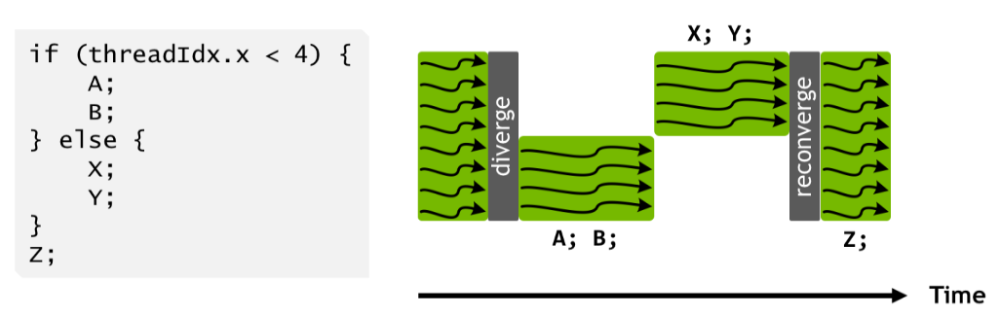
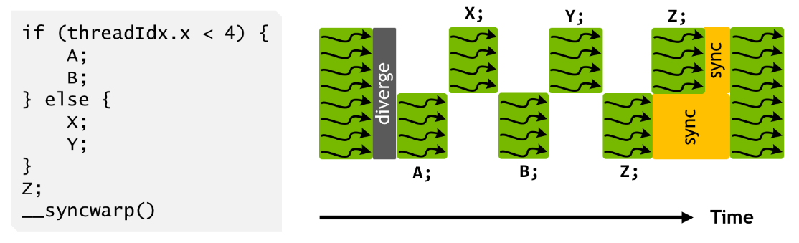
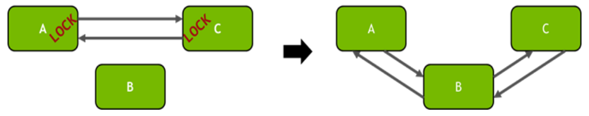

Reduce and scan operations are core building blocks in the world of parallel computing, and now [Nabla has a new release](https://github.com/Devsh-Graphics-Programming/Nabla/tree/v0.6.2-alpha1) with those operations made even faster for Vulkan at the subgroup and workgroup levels.

This article takes a brief look at the Nabla implementation for reduce and scan on the GPU in Vulkan.

Then, I discuss a missing execution dependency expected for a subgroup shuffle operation, which was only a problem on Nvidia devices in some test cases.

<!-- truncate -->

## Reduce and Scan

Let's give a quick introduction, or recap for those already familiar, to reduce and scan operations.

A reduction takes a binary associative operator $\bigoplus$ and an array of $n$ elements

$\left[x_0, x_1,...,x_{n-1}\right]$,

and returns

$x_0 \bigoplus x_1 \bigoplus ... \bigoplus x_{n-1}$.

In other words, when $\bigoplus$ is an addition, a reduction of the array $X$ is then the sum of all elements of array $X$.

```
Input:      4  6  2  3  7  1  0  5
Reduction:  28
```

A scan is a generalization of reduction, and takes a binary associative operator $\bigoplus$ with identity $I$ and an array of $n$ elements.
Then, for each element, performs the reduction from the first element to the current element.
An _exclusive_ scan does so for all elements before the current element.

$\left[I, x_0, (x_0 \bigoplus x_1), ..., (x_0 \bigoplus x_1 \bigoplus ... \bigoplus x_{n-2})\right]$.

An _inclusive_ scan then includes the current element as well.

$\left[x_0, (x_0 \bigoplus x_1), ..., (x_0 \bigoplus x_1 \bigoplus ... \bigoplus x_{n-1})\right]$.

Notice the last element of the inclusive scan is the same as the reduction.

```
Input:      4  6  2  3  7  1  0  5
Exclusive:  0  4  10 12 15 22 23 23
Inclusive:  4  10 12 15 22 23 23 28
```

## Nabla's subgroup scans

We start with the most basic of building blocks: doing a reduction or a scan in the local subgroup of a Vulkan device.
Pretty simple actually, since Vulkan already has subgroup arithmetic operations supported.
Nabla exposes this via the [GLSL compatibility header](https://github.com/Devsh-Graphics-Programming/Nabla/blob/v0.6.2-alpha1/include/nbl/builtin/hlsl/glsl_compat/subgroup_arithmetic.hlsl) built of [HLSL SPIR-V inline intrinsics](https://github.com/Devsh-Graphics-Programming/Nabla/blob/v0.6.2-alpha1/include/nbl/builtin/hlsl/spirv_intrinsics/subgroup_arithmetic.hlsl).

```cpp
nbl::hlsl::glsl::groupAdd(T value)
nbl::hlsl::glsl::groupInclusiveAdd(T value)
nbl::hlsl::glsl::groupExclusiveAdd(T value)
etc...
```

But wait, the SPIR-V-provided operations all require your Vulkan physical device to have support the `GroupNonUniformArithmetic` capability.
So, Nabla provides emulated versions for that too, and both versions are compiled into a single templated struct call.

```cpp
template<class Params, class BinOp, uint32_t ItemsPerInvocation, bool native>
struct inclusive_scan;

template<class Params, class BinOp, uint32_t ItemsPerInvocation, bool native>
struct exclusive_scan;

template<class Params, class BinOp, uint32_t ItemsPerInvocation, bool native>
struct reduction;
```

The implementation of emulated subgroup scans make use of subgroup shuffle operations to access partial sums from other invocations in the subgroup.
This is based on the [Kogge–Stone adder (KSA)](https://developer.nvidia.com/gpugems/gpugems3/part-vi-gpu-computing/chapter-39-parallel-prefix-sum-scan-cuda), using $\log_2 n$ steps where $n$ is the subgroup size with all lanes active.
It should also be noted that in cases like this where the SIMD/SIMT processor pays for all lanes regardless of whether or not they're active, the KSA design is faster than more theoretically work-efficient parallel scans like the Blelloch (which we use at the workgroup granularity).

```cpp
T inclusive_scan(T value)
{
    rhs = shuffleUp(value, 1)
    value = value + (firstInvocation ? identity : rhs)

    [unroll]
    for (i = 1; i < SubgroupSizeLog2; i++)
    {
        nextLevelStep = 1 << i
        rhs = shuffleUp(value, nextLevelStep)
        value = value + (nextLevelStep out of bounds ? identity : rhs)
    }
    return value
}
```

In addition, Nabla also supports passing vectors into these subgroup operations, so you can perform reduce or scans on up to subgroup size * 4 (for `vec4`) elements per call.
Note that it expects the elements in the vectors to be consecutive and in the same order as the input array.
This is because we've found through benchmarking that the instructing the GPU to do a vector load/store results in faster performance than any attempt at coalesced load/store with striding.

We also found shuffles and vector arithmetic to be very expensive, and so having the least amount of data exchange between invocations and pre-scanning up to 4 elements within an invocation was significantly faster.

You can find all the implementations on the [Nabla repository](https://github.com/Devsh-Graphics-Programming/Nabla/blob/v0.6.2-alpha1/include/nbl/builtin/hlsl/subgroup2/arithmetic_portability_impl.hlsl)

## An issue with subgroup sync and reconvergence

Now, onto a pretty significant, but strangely obscure, problem that I ran into during unit testing this prior to release.
[See the unit tests.](https://github.com/Devsh-Graphics-Programming/Nabla-Examples-and-Tests/blob/master/23_Arithmetic2UnitTest/app_resources/testSubgroup.comp.hlsl)
Nabla also has implementations for workgroup reduce and scans that make use of the subgroup scans above, and one such section looks like this.

```cpp
... workgroup scan code ...

debug_barrier()
for (idx = 0; idx < VirtualWorkgroupSize / WorkgroupSize; idx++)
{
    value = getValueFromDataAccessor(memoryIdx)

    value = subgroup::inclusive_scan(value)

    setValueToDataAccessor(memoryIdx)

    if (lastSubgroupInvocation)
    {
        setValueToSharedMemory(smemIdx)
    }
}
workgroup_execution_and_memory_barrier()

... workgroup scan code ...
```

_I should note that this is the first level of scans for the workgroup scope. It is only one step of the algorithm and the data accesses are completely independent. Thus, `memoryIdx` is unique and per-invocation, and also that shared memory is only written to in this step to be accessed in later steps._

At first glance, it looks fine, and it does produce the expected results for the most part... except in some very specific cases.
After some more testing and debugging to try and identify the cause, I've found the conditions to be:

* using an Nvidia GPU
* using emulated versions of subgroup operations
* a decent number of iterations in the loop (in this case at least 8).

I tested this on an Intel GPU, to be sure, and the workgroup scan ran correctly.
This was very baffling initially. And the results produced on an Nvidia device looked like a sync problem.

It was even more convincing when I moved the control barrier inside the loop and it immediately produced correct scan results.

```cpp
... workgroup scan code ...

debug_barrier()
for (idx = 0; idx < VirtualWorkgroupSize / WorkgroupSize; idx++)
{
    value = getValueFromDataAccessor(memoryIdx)

    value = subgroup::inclusive_scan(value)

    setValueToDataAccessor(memoryIdx)

    if (lastSubgroupInvocation)
    {
        setValueToSharedMemory(smemIdx)
    }
    workgroup_execution_and_memory_barrier()
}

... workgroup scan code ...
```

Ultimately, we came to the conclusion that each subgroup invocation was probably somehow not in sync as each loop went on.
Particularly, the effect we're seeing is a shuffle done as if `value` is not in lockstep at the call site.
We tested using a subgroup execution barrier and maximal reconvergence.
Strangely enough, just a memory barrier also fixed it, which it shouldn't have as subgroup shuffles are magical intrinsics that take arguments by copy and don't really deal with accessing any memory locations (SSA form).

```cpp
T inclusive_scan(T value)
{
    subgroup_execution_barrier()
    rhs = shuffleUp(value, 1)
    value = value + (firstInvocation ? identity : rhs)

    [unroll]
    for (i = 1; i < SubgroupSizeLog2; i++)
    {
        nextLevelStep = 1 << i
        subgroup_execution_barrier()
        rhs = shuffleUp(value, nextLevelStep)
        value = value + (nextLevelStep out of bounds ? identity : rhs)
    }
    return value
}
```

However, this problem was only observed on Nvidia devices.

As a side note, using the `SPV_KHR_maximal_reconvergence` extension doesn't resolve this issue surprisingly.
I feel I should point out that many presentations and code listings seem to give an impression subgroup shuffle operations execute in lockstep based on the very simple examples provided.

For instance, [the example in this presentation](https://vulkan.org/user/pages/09.events/vulkanised-2025/T08-Hugo-Devillers-SaarlandUniversity.pdf) correctly demonstrates where invocations in a tangle are reading and storing to SSBO, but may mislead readers into not considering the Availability and Visibility for other scenarios that need it.

Such simple examples are good enough to demonstrate the purpose of the extension, but fail to elaborate on specific details.
If it did have a read-after-write between subgroup invocations, subgroup scope memory dependencies would have been needed.

(With that said, since subgroup operations are SSA and take arguments "by copy", this discussion of Memory Dependencies and availability-visibility is not relevant to our problem, but just something to be aware of.)

### A minor detour onto the performance of native vs. emulated on Nvidia devices

Since all recent Nvidia GPUs support subgroup arithmetic SPIR-V capability, why were we using emulation with shuffles?
I think this observation warrants a small discussion section of its own.
The table below are some numbers from our benchmark measured through Nvidia's Nsight Graphics profiler of a subgroup inclusive scan using native SPIR-V instructions and our emulated version.

#### Native

| Workgroup size | SM throughput (%) | CS warp occupancy (%) | # registers | Dispatch time (ms) |
| :------------: | :---------------: | :-------------------: | :---------: | :----------------: |
| 256           | 41.6              | 90.5                  | 16            | 27                |
| 512           | 41.4              | 89.7                  | 16            | 27.15             |
| 1024          | 40.5              | 59.7                  | 16            | 27.74             |

#### Emulated

| Workgroup size | SM throughput (%) | CS warp occupancy (%) | # registers | Dispatch time (ms) |
| :------------: | :---------------: | :-------------------: | :---------: | :----------------: |
| 256           | 37.9              | 90.7                  | 16            | 12.22             |
| 512           | 37.7              | 90.3                  | 16            | 12.3              |
| 1024          | 37.1              | 60.5                  | 16            | 12.47             |

These numbers are baffling to say the least, particularly the fact that our emulated subgroup scans are twice as fast than the native solution.
It should be noted that this is with the subgroup barrier before every shuffle, we did not see any marked decrease in performance.

An potential explanation for this may be that Nvidia has to consider any inactive invocations in a subgroup, having them behave as if they contribute the identity $I$ element to the scan.
Our emulated scan instead requires people call the arithmetic in subgroup uniform fashion.
If that is not the case, this seems like a cause for concern for Nvidia's SPIR-V to SASS compiler.

### What could cause this behavior on Nvidia? — The Independent Program Counter

We think a potential culprit for this could be Nvidia's Independent Program Counter (IPC) that was introduced with the Volta architecture.

Prior to Volta, all threads in a subgroup share the same program counter, which handles scheduling of instructions across all those threads.
This means all threads in the same subgroup execute the same instruction at any given time.
Therefore, when you have a branch in the program flow across threads in the same subgroup, all execution paths generally have to be executed and mask off threads that should not be active for that path.

<figure class="image">
    
    <figcaption>Thread scheduling under the SIMT warp execution model of Pascal and earlier NVIDIA GPUs. Taken from [NVIDIA TESLA V100 GPU ARCHITECTURE](https://images.nvidia.com/content/volta-architecture/pdf/volta-architecture-whitepaper.pdf)</figcaption>
</figure>

With Volta up to now, each thread has its own program counter that allows it to execute independently of other threads in the same subgroup.
This also provides a new possibility on Nvidia devices, where you can now synchronize threads in the same subgroup.
The active invocations still have to execute the same instruction, but it can be at different locations in the program (e.g. different iterations of a loop).

<figure class="image">
    
    <figcaption>Independent thread scheduling in Volta architecture onwards interleaving execution from divergent branches, using an explicit sync to reconverge threads. Taken from [NVIDIA TESLA V100 GPU ARCHITECTURE](https://images.nvidia.com/content/volta-architecture/pdf/volta-architecture-whitepaper.pdf)</figcaption>
</figure>

In CUDA, this is exposed through `__syncwarp()`, and we can do similar in Vulkan using subgroup control barriers.

The IPC also enables starvation-free algorithms on CUDA, along with the use of mutexes where a thread that attempts to acquire a mutex is guaranteed to eventually succeed. Consider the example in the Volta whitepaper of a doubly linked list:

```cpp
__device__ void insert_after(Node* a, Node* b)
{
    Node* c;
    lock(a);
    lock(a->next);
    c = a->next;

    a->next = b;
    b->prev = a;

    b->next = c;    
    c->prev = b;

    unlock(c);
    unlock(a);
}
```

The diagram shows how, with IPC, even if thread K holds the lock for node A, another thread J in the same subgroup (warp in the case of CUDA) can wait for the lock to become available and not affect K's progress.

<figure class="image">
    
    <figcaption>Locks are acquired for nodes A and C, shown on the left, before the threads inserts node B shown on the right. Taken from [NVIDIA TESLA V100 GPU ARCHITECTURE](https://images.nvidia.com/content/volta-architecture/pdf/volta-architecture-whitepaper.pdf)</figcaption>
</figure>

In our case however, it's entirely possible that each subgroup shuffle operation does not run in lockstep with the branching introduced, which would be why subgroup execution barriers are our solution to the problem for now.

Unfortunately, I couldn't find anything explicit mention in the SPIR-V specification that confirmed whether subgroup shuffle operations actually imply execution dependency, even with hours of scouring the spec.

So then we either have...

## This is a gray area of the Subgroup Shuffle Spec and allowed Undefined Behaviour

Consider what it means if subgroup convergence doesn't guarantee that active tangle invocations execute a subgroup operation in lockstep.

Subgroup ballot and ballot arithmetic are two where you don't have to consider lockstepness, because it is expected that the return value of ballot to be uniform in a tangle, and as a corollary, it is known exactly what it should be.

Similarly, for subgroup broadcasts, first the value being broadcast needs to computed, say from invocation K.
Even if other invocations don't run in lockstep, they can't read the value until invocation K broadcasts it if they want to read the same value (uniformity) and you know what value should be read (broadcasting invocation can check it got the same value back).

On the flip side, reductions will always produce a uniform return value for all invocations, even if you reduce a stale or out-of-lockstep input value.

Meanwhile, subgroup operations that don't return tangle-uniform values, such as shuffles and scans, would only produce the expected result only if performed on constants or variables written with an execution dependency.
These operations can give different results per invocation so there's no implied uniformity, which means there's no reason to expect any constraints on their apparent lockstepness being implied transitively through the properties of the return value.

The important consideration then is how a subgroup operation is implemented.
When a subgroup operation doesn't explicitly state that they all have to execute at the same time by all invocations, we can imagine a scenario where a shuffle may be as simple as the receiving invocation snooping another's register without requiring any action on the latter's part.
And that comes with obvious IPC dangers, as snooping it before it gets written or after it gets overwritten if there are no other execution dependencies will surely provide inconsistent results.

This leads to code listings like the following becoming undefined behavior simply by changing the `Broadcast` into a `Shuffle`.

```cpp
// Broadcasting after computation
// OK, only counts active invocations in tangle (doesn't change)
int count = subgroupBallotBitCount(true);
// OK, done on a constant
int index = subgroupExclusiveAdd(1);
int base, base_slot;
if (subgroupElect())
    base_slot = atomicAdd(dst.size,count);
// NOT OK, `base_slot` not available, visible or other invocations may even have raced ahead of the elected one
// Not every invocation will see the correct value of `base_slot` in the elected one memory dependency not ensured
base = subgroupBroadcastFirst(base_slot);
```

Similarly again, with [this example from the Khronos blog on maximal reconvergence](https://www.khronos.org/blog/khronos-releases-maximal-reconvergence-and-quad-control-extensions-for-vulkan-and-spir-v)

```cpp
// OK, thanks to subgroup uniform control flow, no wiggle room here (need to know all invcocation values)
if (subgroupAny(needs_space)) {
   // OK, narrowly because `subgroupBallot` returns a ballot thats uniform in a tangle 
   uvec4 mask = subgroupBallot(needs_space);
   // OK, because `mask` is tangle-uniform
   uint size = subgroupBallotBitCount(mask);
   uint base = 0;
   if (subgroupElect())
     base = atomicAdd(b.free, size);

    // NOT OK if replaced Broadcast with Shuffle, non-elected invocations could race ahead or not see (visibility) the `base` value in the elected invocation before that one would excecute a shuffle
    base = subgroupBroadcastFirst(base);
    // OK, but only because `mask` is tangle-uniform
    uint offset = subgroupBallotExclusiveBitCount(mask);

    if (needs_space)
      b.data[base + offset] = ...;
}
```

With all that said, it needs to be noted that one can't expect every instruction to run in lockstep, as that would negate the advantages of Nvidia's IPC.

## Or a bug in Nvidia's SPIR-V to SASS compiler

And crucially, it's impossible to know (or discuss in the case of a signed NDA) what's happening for the bug or performance regression with Nvidia.
Unlike AMD's RDNA ISAs where we can verify that the compiler is doing what it should be doing using Radeon GPU Analyzer, the generated SASS is inaccessible and neither is the compiler public.

----------------------------
_This issue was observed happening inconsistently on Nvidia driver version 576.80, released 17th June 2025._

## Update as of February 2026

We've been informed that Nvidia noticed this blog post in June 2025 and issued a fix in July 2025.
We then re-ran our benchmarks for subgroup operations on Nvidia driver version 591.86, released 27th January 2026, and can confirm there are improvements.

### Benchmarks for workgroup size 256, items per invocation=1

When pre-scanning only 1 item per invocation, inclusive scan performance is observed to be about equal between native and emulated.
However, for exclusive scan, there is about a 1.17x speedup when using emulated, as opposed to native.

#### Inclusive scan

| Operation mode | SM throughput (%) | CS warp occupancy (%) | # registers | Dispatch time (ms) |
| :------------: | :---------------: | :-------------------: | :---------: | :----------------: |
| Native         | 69.5              | 97.9                  | 16            | 12.24             |
| Emulated       | 37.9              | 97.7                  | 16            | 12.22             |

#### Exclusive scan

| Operation | SM throughput (%) | CS warp occupancy (%) | # registers | Dispatch time (ms) |
| :------------: | :---------------: | :-------------------: | :---------: | :----------------: |
| Native         | 60.2              | 97.8                  | 16            | 17.15             |
| Emulated       | 36.9              | 98.1                  | 16            | 14.66             |

### Benchmarks for workgroup size 256, items per invocation=4

In contrast, with 4 items per invocation, we observe around 1.17x speedup when using emulated over native operations for both inclusive and exclusive scans.

#### Inclusive scan

| Operation mode | SM throughput (%) | CS warp occupancy (%) | # registers | Dispatch time (ms) |
| :------------: | :---------------: | :-------------------: | :---------: | :----------------: |
| Native         | 68.3              | 92.7                  | 18            | 4.45             |
| Emulated       | 44.8              | 92.6                  | 17            | 3.78             |

#### Exclusive scan

| Operation | SM throughput (%) | CS warp occupancy (%) | # registers | Dispatch time (ms) |
| :------------: | :---------------: | :-------------------: | :---------: | :----------------: |
| Native         | 70.0              | 92.7                  | 18            | 4.45             |
| Emulated       | 42.6              | 92.7                  | 16            | 3.78             |
