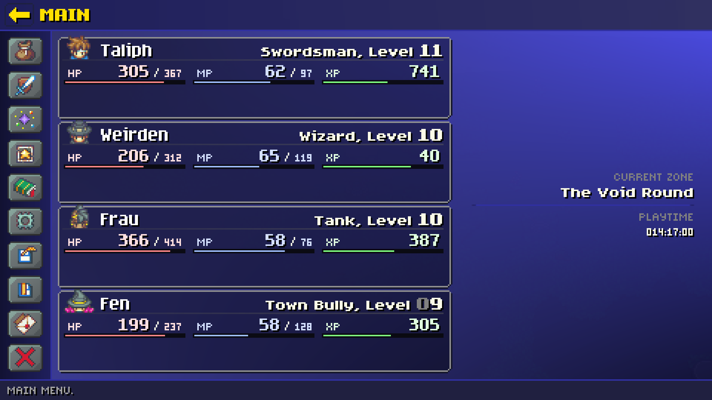
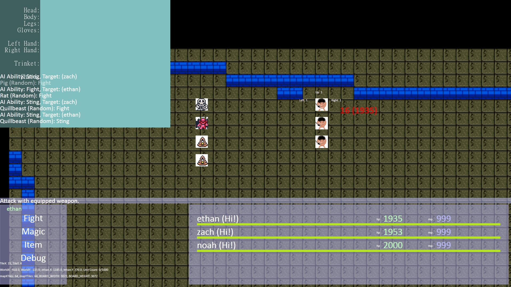
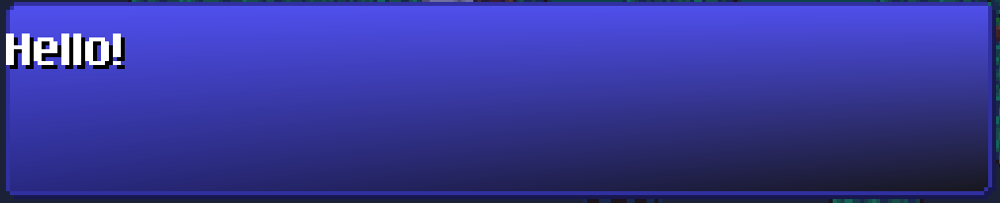
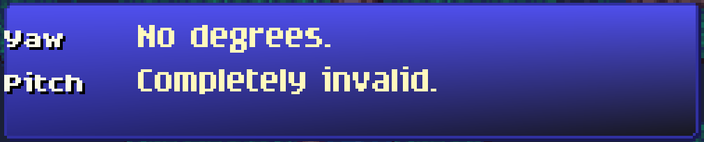
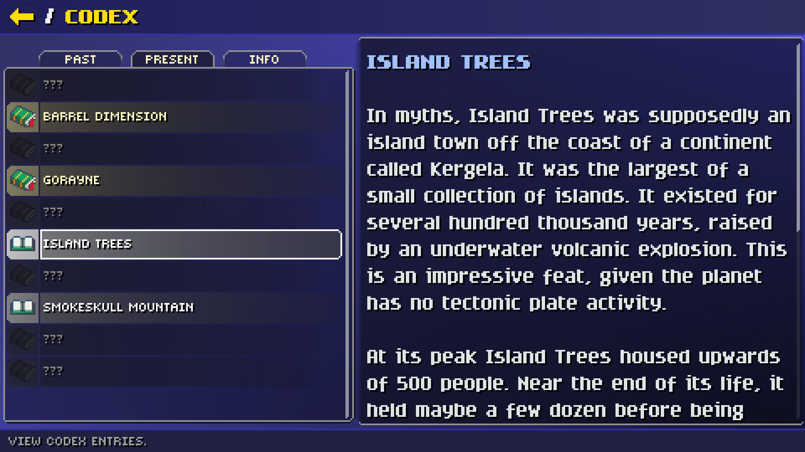

If you're like me, you've thought to yourself at least once: "Hey, making a UI can't be that hard! I wouldn't need to add any more headers or libraries to my project!" Because not having to deal with C++ is a good reason to write your own UI.

Well, I did it for my game, Twin Gods. I can't remember why anymore beyond "hey, that sounds like fun". Am I glad I have it? Yes! You very much learn a lot about how a UI works. Would I do it again? Probably not.

What came out the other end is a confusing mixture of knowledge, a lot of head-bashing, years of code that went sideways more than once, and a working UI for a functioning game. Let's see how it works, shall we?

This is not an article to sell you on using my UI ([\*0](#note-id-0)). This is only intended as a showcase of how it works, *why* it works that way, what went into making it, and how difficult it is to make a UI from scratch. And I cannot overstate how difficult it is -- *and how much time it takes* -- to make a UI from scratch.

<!-- truncate -->

## There's a Lot to Cover

In this article, we'll cover:

1. Defining a UI element with a simple example
2. How materials are defined
3. How text and color styles are defined
4. The template system
5. How this all helped shape the look of the game's UI

Other topics, such as data binding (don't be fooled by this only being two words, this is *type-checked* on game startup), callbacks, the click feedback system, the dialog transition system, text rendering (which, [hates you](https://faultlore.com/blah/text-hates-you/)), the UI loader (a rather vital part), building a UI editor, the script wait system, the UI flow and layout system, how the UI is rendered, the "vis stack" (again, don't be fooled by it only being two words), mouse vs gamepad navigation, the UI event system, lists, the placeholder text system, and how the data is actually organized engine-side will be left to future articles.



## But First

I will be blunt: I want to neither encourage nor discourage you from using the general paradigm used by Twin Gods' UI. This is only one man's journey from an empty code file to a fully-featured UI used in a video game.

A few names. Twin Gods' engine is dubbed **Hauntlet**. The UI library has no name so we'll refer to it as "Twin Gods UI", or "TGUI" (because I think HUI sounds silly). Like all the rest of Hauntlet, it is in C++ and is rendered with OpenGL 4.6.

Due to the class names on the engine side, I tend to refer to any "UI element" as a "dialog", which corresponds to the `DialogItem` class we'll see later.

## Let's Begin

Let's see how it all started.



Rough, eh? That screenshot is dated 2011. Nevermind the hilarious artwork, how did TGUI go from a fever dream to something someone might not actually downvote on Steam out of sheer anger?

The basics of TGUI have not changed since 2011 ([\*1](#note-id-1)). The main workhorse is a class called `DialogItem`. TGUI has no "controls" as you'd expect of a UI library, which is a relic from its early days as a "I didn't know what I was doing" sort of thing ([\*2](#note-id-2)). Every UI element is a `DialogItem`. `DialogItem` contains a `std::vector<DialogItem>` member.

If I remember right, the original version contained only the very basics: support for a background image, on-click event, text, child elements, and the layout type (row, column, pure x/y). It also used to support drag and drop. (Implement *that* at your own peril.)

It's all gotten more complicated since then. Additionally, the concept of controls *did* emerge, though not through the C++ side of things. We'll get to that a little later.

A consequence of this setup is that every UI element contains all the attributes used to make up everything seen in the UI. `DialogItem` is reported as being 1,480 bytes in release mode. It's quite large. This is one reason why `DialogItem`s are stored as a vector on its parent and not, say, a bunch of pointers. (We'll ignore the possible bikeshedding in this article. The data side of things changed quite a few times.)

And, okay, I lied. There is one specific control: lists. For a later article.

But of course, the definition of a TGUI `UIFrame` is just as important as the engine code behind it. TGUI's XML might as well be its own language and is one of its primary strengths, I think.

## Defining a UI

All screenshots in this article were captured from the running game.

Here's a simple example UIFrame.

```xml
<UIFrame Name="simple-example" Size="250,50" Anchor="Center" BackColor="White" Background=";materials\unit speech frame.mat">
    <Node Name="downbox-1" Text="Hello!" FontStyle="Paragraph-Normal16" />
</UIFrame>
```

That XML produces this UI.



Hideous! Much of the XML should be self-explanatory but let's cover a few less-obvious points.

* The top-level node must be a `UIFrame`. The valid child nodes we'll see here: `AcrossBox`, `DownBox`, and `Node`.

* `DownBox` and `AcrossBox` act like layout containers in other UI systems. `DownBox` "flows" (positions) all child dialogs as rows and `AcrossBox` flows all child dialogs as columns. `Node` is expected to have no children, applies no flow, and is basically undefined behavior if you try it. (`Node` is mostly symbolic; you can absolutely have `DownBox` as a leaf.)

* Because the `DialogItem` class is used for everything, every XML node has every property with some exceptions based on context. For example, the top-level `UIFrame` node is the only one that can have the `Transition-Type` attribute.

* `BackColor` is applied on top of any materials. If it was "Red", the resulting shader color is then multiplied by red.

* The astute reader may note the `;` hanging out in front of the `Background` attribute. For better or worse TGUI's XML reflects its history ([\*3](#note-id-3)). The semicolon denotes a material file. `Background="plain texture.webp"` would specify a texture directly. We'll see a material soon.

* `Anchor` is a note to the layout and flow code. It determines the initial position of the dialog. "Center" simply means it is laid out in the middle of its parent. Other options are "TopLeft", "Top", "TopRight", etc.

* `Name` is how the frame is referred to in code and via any scripts (in Lua).

From the beginning, TGUI used XML ([\*4](#note-id-4)). Much has been added but the basic file format has not changed much in the past 13 years. The entire UI is defined in a single file, "UI Frames.xml".

## High-Level Storage Concept

An aside on data.

Storage of the entire UI boils down to a single `vector`. The above XML produces 2 dialogs (or `DialogItem`s): the top-level "UIFrame" node and the "Node" node. The entire `DialogItem` tree is then stuffed into its own `UIFrame` object. That `UIFrame` is stored in the master frames list: `std::vector<UIFrame> UIFrames`. This `UIFrames` (note the "s") list has the same lifetime as the running game.

At a basic level, this `UIFrame` object is a fancy container for a single UI tree with additional properties left for future articles. One could more casually refer to a "UI frame" as a "window", "screen", "prompt", etc.

The whole tree inside a `UIFrame` is displayed at once, barring any `DialogItem`s that are set invisible.

It's important to note that a `UIFrame` is single-instance. Once loaded, the engine does not duplicate or create a new instance of any of these objects when they are displayed in-game. The tree is never touched after load.

Obviously, even though the *tree* is essentially read-only, the actual `DialogItem`s are written to quite frequently, especially during data binding.

While all `UIFrame`s are stored in the aforementioned `UIFrames` list, a `UIFrame` can optionally be stored in a variable, referred to as a "named frame". After parsing `UI Frames.xml` on startup, the engine looks for all named frames specified in code (eg, `UIFrame SimpleExample("simple_example")`) and shows an error for any that it can't find.

Many important `UIFrame`s are "named frames" for direct reference in code (eg, `UIFrames().SimpleExample.show()`). This is commonly used for data binding.

Hauntlet's Lua scripting system can access and write to `DialogItem`s. This means a script can maintain and update its own UI, though it cannot create new `DialogItem`s.

## Materials

Here's the definition of the material used above ([\*5](#note-id-5)):

```xml title="materials\unit speech frame.mat"
<material texture="textures\ui\unit speech.sliced.png" shader="shaders\ui\dialog9SliceGradient4.shader">
    <uniform name="colorTopLeft" type="color" value="DialogGradientVeryLight" />
    <uniform name="colorTopRight" type="color" value="DialogGradientVeryLight" />
    <uniform name="colorBottomLeft" type="color" value="MediumDarkBlue" />
    <uniform name="colorBottomRight" type="color" value="VeryDarkGray" />
    <uniform name="colorBorder" type="color" value="DialogBorder" />
</material>
```

I won't show the shader but it is a basic ["9-slice"](https://en.wikipedia.org/wiki/9-slice_scaling) shader with support for coloring at the 4 corners and a border color, hence the 5 uniforms.

**It cannot be overstated how important materials were to the look and ease of development of Twin Gods' UI.** The screenshot shown in the top of the article represents the third major "rewrite" of the UI.

More on how this helped later.

## UI Styles

Note the value of `value` in the material. It can be set to either a hex color (starting with a "#") or a *named* color defined in the "UI Styles" file. "UI Styles.xml" is a companion piece to "UI Frames.xml".

It can define colors:

```xml
<Color Name="OffWhite" Color="#FBFBE8FF" />
<Color Name="VeryDarkGreen" Red="0" Green="0.3" Blue="0" Alpha="1" />
```
Why both ways? A decade of legacy cruft (and, importantly, laziness).

It can also define fonts.

```xml
<FontStyle Name="Unit-Damage-Crit" LineHeight="8" Font="short\16-outline" Color="White" Outline="VeryDarkRed" Align-Horiz="Center" Shader="shaders\font\font-bounce.shader" />
<FontStyle Name="UnitBlock" Font="tall\16" Color="White" Outline="MediumDarkBlue" DropShadow="1,1" />
```

It can even define the prefix folder from which all pull fonts ([\*6](#note-id-6)).

```xml
<FontStyles FontPrefix="fonts\nope">
```

This means that when a `Font` specifies "short\16-outline", the full folder is "fonts\nope\short\16-outline".

You'll also notice a `FontStyle` attribute, which makes it look like each dialog only supports a single font style.


Text styling will be covered in a later article.

In any case, the "UI Styles" file is a vague CSS-like system. I can specify color, font face, font size, shader, outline, and a few other things but that's it. It does not support things like animation. That is left to shaders.

I should note before anyone gets mad that if `DropShadow` appears in a `FontStyle`, the `Outline` color becomes the drop shadow color. 13 years of *cruft*!

## Templates, In My UI?

One of the more interesting features, I think, is TGUI's template capability. This is why TGUI will probably never get official support for controls.

```xml
<Template Name="test-field" BackColor="White">
  <Node Name="label" FontStyle="Short-Normal16" />
  <Node Name="value" FontStyle="Paragraph-Highlight16" />
</Template>

<UIFrame Name="tester2" Size="250,50" Anchor="Center" BackColor="White" Background=";materials\unit speech frame.mat">
  <DownBox>
    <AcrossBox:test-field label:Text="Yaw" value:Text="No degrees." BackColor="Red" />
    <AcrossBox:test-field label:Text="Pitch" value:Text="Completely invalid." />
  </DownBox>
</UIFrame>
```

The above XML produces this:


I said earlier the engine treats the UI tree as essentially read-only, right? So what happened? The template system happened.

## How Templates Expand

When the UI loader encounters a `Template` node, it is put aside into a separate "templates" list, noting the name, and moves on to the next top-level node. When it encounters an XML node of the name format `ValidNodeType:TemplateName`, the template system gets to work.

The previously-set-aside node now acts like it was copied and pasted in-place.

This XML:

```xml
<AcrossBox:test-field label:Text="Yaw" value:Text="No degrees." BackColor="Red" />
```

Expands to:

```xml
<AcrossBox Name="test-field" BackColor="Red">
  <Node Name="label" Text="Yaw" FontStyle="Short-Normal16" />
  <Node Name="value" Text="No degrees." FontStyle="Paragraph-Highlight16" />
</AcrossBox>
```

`AcrossBox:test-field` pulls the XML for `test-field`, copying and pasting it and all its child nodes on top of the `AcrossBox` node, as if `AcrossBox` is the same node as the `Template` top-level node. To make this last point more clear: `BackColor="Red"` (which visually does nothing here), overwrites `BackColor="White"` (also does nothing).

### Templated Attribute Resolution

The template parser sees the same attribute (`BackColor`, in this case) on the same node, post-parse, as the top-level `Template` node and overwrites the template's attribute with the incoming real node.

On the second `AcrossBox`, the template's original `BackColor="White"` stays because the incoming real node has no such attribute.

### Template Attribute Expansion Assignment

What about `label:Text` and `value:Text`? The syntax may be cursed but I could not live without this feature. It searches down the tree, depth only, until it finds a dialog with the given name and then sets the given attribute. Only the first one found is acted upon and the rest are ignored. There is no way to access the duplicates and, frankly, it hasn't ever come up as a problem.

### Data Binding and UI Controls

This "attribute expansion" part of the success of how templates work. Data binding abuses this whole-heartedly and quite literally makes some features possible. You can very much create distinct controls with templates as we'll soon see.

### Improve the Look With Templates

Getting back to our example, let's add some structure to it. The label is not a fixed size. We can make this a little better without putting a size everywhere  -- since that is, after all, the entire point of TGUI's templates.

```xml
<Template Name="test-label" Width="48" FontStyle="Short-Normal16" />

<Template Name="test-field" BackColor="White">
  <Node:test-label Name="label" />
  <Node Name="value" FontStyle="Paragraph-Highlight16" />
</Template>

<UIFrame Name="tester2" Size="250,50" Anchor="Center" BackColor="White" Background=";materials\unit speech frame.mat">
  <DownBox>
    <AcrossBox:test-field label:Text="Yaw" value:Text="No degrees." />
    <AcrossBox:test-field label:Text="Pitch" value:Text="Completely invalid." />
  </DownBox>
</UIFrame>
```

Yep, templates can have templates. ~~I heard you like templates so I put a template in your template.~~

The result:



We can do better. Let's remove the width, letting the flow system do all the work. We'll set a margin, add a texture, and fixed widths only where necessary.

```xml
<Template Name="test-label" Width="48" FontStyle="Short-Normal16" />
<Template Name="test-field" FontStyle="Paragraph-Highlight16" />

<Template Name="test-combo" BackColor="White" InnerMargin="2,2,2,2" Width="160" Background=";materials\affinity box empty.mat">
  <Node:test-label Name="label" />
  <Node Name="value" FontStyle="Paragraph-Highlight16" />
</Template>

<UIFrame Name="tester2" Anchor="Center" BackColor="White" Background=";materials\unit speech frame.mat" InnerMargin="2,2,2,2">
  <DownBox>
    <AcrossBox:test-combo label:Text="Yaw" value:Text="No degrees." />
    <Node Height="1" />
    <AcrossBox:test-combo label:Text="Pitch" value:Text="Completely invalid." />
  </DownBox>
</UIFrame>
```


There. It won't win any awards but it's a fine example of what TGUI's template system can do. It also does illustrate one of TGUI's limitations: the flow and layout code has no way to set a "minimum expanding" width. If the "label" text expanded past the width of "test-combo", it would simply extend past the frame and look weird.


This has caused a few problems, where using a template a certain way would have been nice, but the layout and flow code is incapable of such a feat at present. In the end, I sometimes simply set sizes.

We'll save the problem of creating a UI/text flow/layout system for another day. Let's finish up by just seeing how this all helped shape TGUI's look.

## Shaping the Look of Twin Gods' UI

Where we've been and where we are.

 

The first picture is "version 2" of the Twin Gods UI. The second picture is obviously the current iteration. Apart from the difference in navigation, note the *drastic* difference in coloration.

One of Hauntlet's hallmark features as a dev tool is its in-game console. All UI-related data can be hot-reloaded in-game. *It cannot be overstated* how important *fast iteration* is to game development in general. Being able to edit a file and see the result in-game immediately is *fabulous*. Hauntlet has a UI editor but nothing beats real data *and* being able to navigate it.

Materials were kind of revolutionary in the look of TGUI primarily because it let me apply colors. I'm rather bad when it comes to graphic design. However, I *eventually* realized one of the many reasons the older UI designs looked rather drab is because they lacked any kind of *texture* (in addition to their lack of contrast). I don't just mean tgas or pngs or jpgs. I mean variance. There are gradients all over the current UI iteration. There are borders. There is contrast.

This may be a no-brainer to any of you experienced in UI design and you may be wondering, if I could hot-reload *all* UI data, why was it not enough to hot-reload textures and that `BackColor` attribute? Because now I could play with color schemes at large and *quickly* change ***everything*** in the UI with just a few edits in "UI Styles.xml". Combine this with the gradient support -- somewhat revolutionary in the color scheme -- and now I could quickly make colorful, pleasing patterns to splash across the screen.

For a long time, the template system was just a way to avoid simply copy/pasting large structures in "UI Frames.xml". Remember that opening screenshot?


Wanna see the XML that makes up the "unit frames"?

```xml
<Template Name="GameMenu.UnitFrame">
  <FrameRow InnerMargin="0,2,0,0">
    <FrameCell Flowable="False" Size="21,16" InnerMargin="0,0,0,0">
      <FrameRow Flowable="False" Offset="3,0" Bind="Party.Unit.Portrait" Size="21,16" />
    </FrameCell>
    <FrameCell Offset="2,4">
      <FrameRow>
        <FrameCell Flowable="False" Size="257,1" Offset="0,12" BackColor="LightGray" Background=";materials\item separator.mat" />
        <FrameCell Offset="26,0" Bind="Party.Unit.Name" BackColor="DarkGray" Text="{}" FontStyle="Paragraph-Normal16" />
      </FrameRow>
      <FrameRow Flowable="False" Width="257" HAlign="Right" Offset="0,-10">
        <FrameCell Text="{}" Bind="Party.Unit.Class" FontStyle="Short-Normal16" />
        <FrameCell Text=", Level " FontStyle="Short-Normal16" />
        <FrameCell Text="{}" Bind="Party.Unit.Level" FontStyle="Header-Normal16" />
      </FrameRow>

      <FrameRow InnerMargin="3,1,1,0">

        <FrameCell>
          <FrameRow Width="100%" InnerMargin="1,0,2,0">
            <FrameCell Text="[color:VeryLightRed] HP[/color]" Bind="Party.Unit.HP.Current" FontStyle="Micro-Normal16" />
            <FrameCell>
              <FrameRow Width="67" HAlign="Right">
                <FrameCell Text="[color:VeryLightRed]{}[/color]" Bind="Party.Unit.HP.Current" FontStyle="Paragraph-Normal16" />
                <FrameCell Text=" / " FontStyle="Micro-Normal16" Offset="0,-1" />
                <FrameCell Text="[color:VeryLightRed]{}[/color]" Bind="Party.Unit.HP.Max" FontStyle="Micro-Normal16" />
              </FrameRow>
            </FrameCell>
          </FrameRow>
          <FrameRow Background=";materials\white.mat" BackColor="ExtremelyDarkGray" Size="82,3">
            <FrameCell Offset="1,1" Background=";materials\white.mat" BackColor="LightRed" Size="80,1" Bind="Party.Unit.HP.Percent" />
          </FrameRow>
        </FrameCell>

        <FrameCell Width="5" />

        <FrameCell>
          <FrameRow Width="100%" InnerMargin="1,0,2,0">
            <FrameCell Text="[color:VeryLightBlue] MP[/color]" Bind="Party.Unit.HP.Current" FontStyle="Micro-Normal16" />
            <FrameCell>
              <FrameRow Width="67" HAlign="Right">
                <FrameCell Text="[color:VeryLightBlue]{}[/color]" Bind="Party.Unit.MP.Current" FontStyle="Paragraph-Normal16" />
                <FrameCell Text=" / " FontStyle="Micro-Normal16" Offset="0,-1" />
                <FrameCell Text="[color:VeryLightBlue]{}[/color]" Bind="Party.Unit.MP.Max" FontStyle="Micro-Normal16" />
              </FrameRow>
            </FrameCell>
          </FrameRow>
          <FrameRow Background=";materials\white.mat" BackColor="ExtremelyDarkGray" Size="82,3">
            <FrameCell Offset="1,1" Background=";materials\white.mat" BackColor="LightBlue" Size="80,1" Bind="Party.Unit.MP.Percent" />
          </FrameRow>
        </FrameCell>

        <FrameCell Width="5" />

        <FrameCell>
          <FrameRow Width="100%" InnerMargin="1,0,2,0">
            <FrameCell Text="[color:VeryLightGreen] XP[/color]" Bind="Party.Unit.HP.Current" FontStyle="Micro-Normal16" />
            <FrameCell>
              <FrameRow Width="67" HAlign="Right">
                <FrameCell Text="[color:VeryLightGreen]{}[/color]" Bind="Party.Unit.Exp.Remaining" FontStyle="Paragraph-Normal16" />
              </FrameRow>
            </FrameCell>
          </FrameRow>
          <FrameRow Background=";materials\white.mat" BackColor="ExtremelyDarkGray" Size="82,3">
            <FrameCell Offset="1,1" Background=";materials\white.mat" BackColor="LightGreen" Size="80,1" Bind="Party.Unit.Exp.Percent" />
          </FrameRow>
        </FrameCell>
      </FrameRow>

      <FrameRow Offset="1,1" List="8,1" ListIconSize="Small" ListItemSpacing="2,0" Bind="Party.Unit.Buff" OnMouseOver="Tooltip.Buff.Show" OnMouseOut="Tooltip.Buff.Hide" List-Item-Size="18,18" ListIconOffset="1,1" Background=";materials\affinity box.mat" FontStyle="Short-Normal16" />
    </FrameCell>
  </FrameRow>
</Template>
```
(`FrameRow` and `FrameCell` are legacy variants of `AcrossBox` and `DownBox` and work *slightly* differently.)

With structures this large repeated all over the place, the template system becomes rather mandatory. Editing colors, fonts, outlines, drop shadows, and what else becomes a few key presses in a file and then a `reloadui()` in the in-game console.

### I Learned A Lot

It is this rather rapid pace of editing that accelerated Twin Gods' look from that desaturated rust color to the bright, much more dynamic-looking UI it has now. (Along with, perhaps, help from other people commenting on the UI as I went along.)

On top of that, I realized the power I had under the hood with templates, which I wound up using to create controls like tabs, buttons, labels, and fields, which in turn brought a more consistent look across the UI. Older versions of the the UI were more prone to minor differences because everything was defined multiple times.

Would Twin Gods' UI have looked like this if I had put in actual distinct controls from the outset instead of using templates to do it? To be fair, it's hard to say for sure. I don't think so, however. In some ways, the current look of the UI is me gaining depth of knowledge of my own tools, realizing what it could *really* do if I pushed it just a little bit.

Of course, this *is* the third version of the UI, which helped me just get better at UI design. But with better tools, it was leaps and bounds faster to make, and make look better.

## In Conclusione

If there's enough interest, there can be future articles. TGUI has many, many more features and lines and lines of code to cover. I would be happy to explain anything in more detail if requested.

In the mean time, Twin Gods is available on [Steam](https://store.steampowered.com/app/2495430/Twin_Gods/) as of this writing as a closed test. Ping me on the GP Discord or [Bluesky](https://bsky.app/profile/domiran.bsky.social) for a key.

P.S.:
It's not a typo, it's Latin. Get cultured.

## Notes

#### (0) {#note-id-0}
Though I may be trying to sell you on buying a copy of Twin Gods.

#### (1) {#note-id-1}
Hauntlet has not been in active development since 2011. For a long time, it was an on-again-off-again project.

#### (2) {#note-id-2}
Arguably, still don't. 

#### (3) {#note-id-3}
A problem you run into when your code is over a decade old. Somehow, TGUI has survived every massive refactor in Hauntlet, and not for lack of trying. There is a *large* comment inside the `DialogItem` class about introducing official UI element control types. (At this point, it will never get done.)

#### (4) {#note-id-4}
Fun fact: the original version of TGUI's definition file could be lightly edited to view in a web browser. This was how the initial UI was created.

#### (5) {#note-id-5}
Astute readers will note the difference in casing between the TGUI data and material data. You can always tell an older file format in Hauntlet because they use CamcelCase. Newer files use kebab-case.

#### (6) {#note-id-6}
Because I'm lazy and haven't updated the `Font` attribute to work like literally every other in-game asset after the last `FileSystem` refactor.
